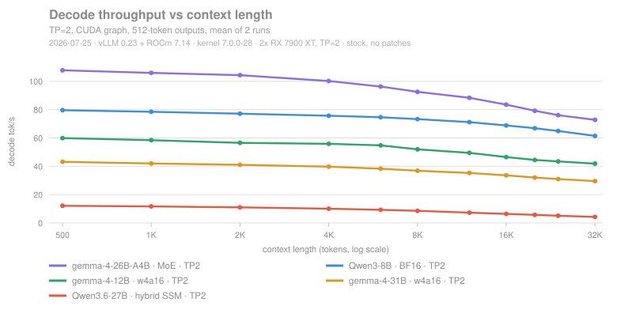
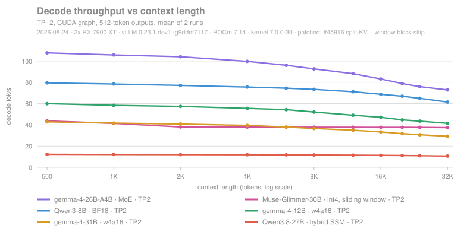
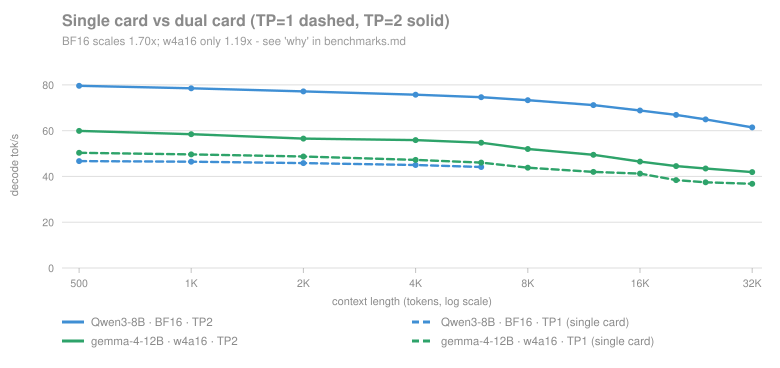
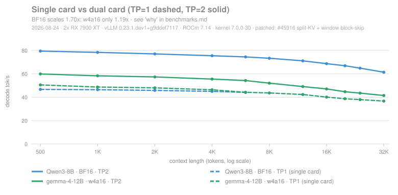
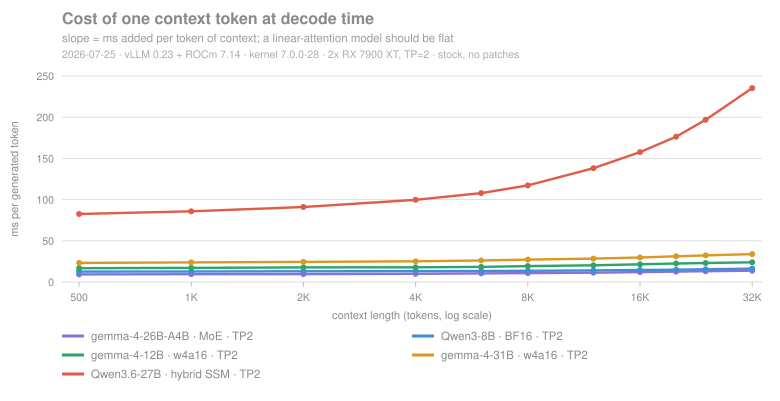
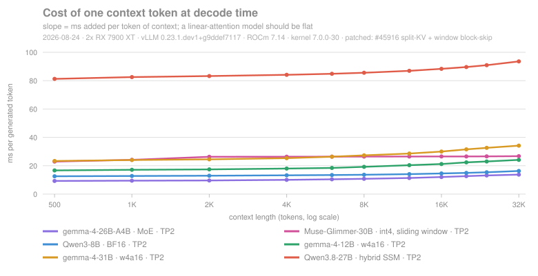
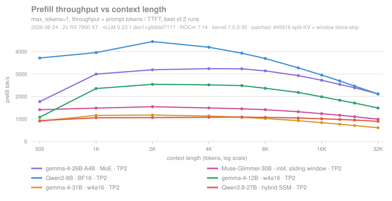

# dual-radeon-vllm

**Tensor-parallel vLLM on two consumer Radeon cards (RX 7900 XT, gfx1100, ROCm 7.14), verified end to end — including the RCCL bug that stops most people before they start.**

`gemma-4-31B` (w4a16) decodes at **43 tok/s** on 2× RX 7900 XT with both cards drawing 265 W *at the same time*, and a 26B MoE reaches **108 tok/s** at short context. The machine is a VFIO virtual machine with **no P2P and cross-die PCIe 3.0**, and those figures were measured with **no PCIe atomics** either: deliberately the least favourable topology.

<table>
<tr>
<td><b>43 tok/s</b><br><sub>gemma-4-31B w4a16, TP=2</sub></td>
<td><b>108 tok/s</b><br><sub>gemma-4-26B-A4B MoE, TP=2</sub></td>
<td><b>1.70×</b><br><sub>TP=2 speed-up on BF16, 85% efficiency</sub></td>
<td><b>265 W × 2</b><br><sub>31B, both cards together = real tensor parallel</sub></td>
</tr>
</table>

### What is in here

Three things, each usable on its own:

| | |
|---|---|
| 🔧 **A fix** | The RCCL bug that makes `--tensor-parallel-size 2` fail on consumer Radeon, root-caused to PCIe AtomicOps, with a 30-line reproducer. **On bare metal the fix is one RCCL rebuild** (recipe and deployment script in here); **in a VM it is usually one line of VM configuration** ([here](docs/vfio-atomics.md)). [Start here](#am-i-hit-by-the-rccl-bug) |
| 📊 **The data** | **292 measurements**: five model architectures across eleven context lengths, single vs dual GPU, with the raw per-request records, the runner that produced them, and analysis scripts that need no GPU. [Charts and findings](#what-performance-to-expect) · [`benchmarks/`](benchmarks/) |
| 🔬 **A regression in the kernel Ubuntu shipped for months — now fixed** | Host→device copies collapse to **2 MiB/s** from a writable file mapping whose pages are resident — the path every PyTorch process takes to load a safetensors checkpoint. Traced to `7.0.0-28-generic`, then the current 24.04 HWE kernel, taking `c08972f55594` without its follow-up `342981fff328`: the `-EBUSY` retry can no longer succeed and burns a full 1000 ms `HMM_RANGE_DEFAULT_TIMEOUT` each time. Every timing we measured is an integer multiple of it. **Proven by revert** — that kernel rebuilt with `342981fff328` applied, nothing else changed, does the copy in **17.0 ms instead of 16 019.7**; model loading on `7.0.0-14` goes 86.7 s → 14.4 s. Filed as [ROCm#6523](https://github.com/ROCm/ROCm/issues/6523), where AMD confirmed the copy-on-write trigger and a third party reproduced it on bare metal, and with Ubuntu as [LP#2161985](https://bugs.launchpad.net/ubuntu/+source/linux-hwe-7.0/+bug/2161985); workaround at [vllm#49991](https://github.com/vllm-project/vllm/pull/49991). **Fixed in `7.0.0-30.30~24.04.1`**, published to `noble-updates` and `noble-security` on 2026-08-20, and **verified here on 2026-08-23**: the same reproducer binary on the same machine goes **16 019.3 ms → 15.3 ms** across the upgrade, with the two control rows inside their own range, 3.0→3.2 ms and 14.5→13.1 ([data](benchmarks/hmm-kernel-three-states.json)). On 24.04 the fix is an upgrade, not the rebuilt module described here; that rebuild is what proved the cause, not what you should run. It arrived through the normal stable route — LP#2161985 is still untriaged, so this repository did not drive it. The separate penalty for *writable* mappings survives, and on 2026-08-23 it was finally measured rather than estimated, by a harness that runs vLLM's own weights iterator ([data](benchmarks/loader-flag-kernel-30.json)): the loader flag is worth **1.5× to 2.0× while the checkpoint fits in RAM and 7.5× when it does not** (21.67 GiB on a 23.4 GiB host, 88.5 s → 11.8 s). The **3.9× to 5.6× published here and upstream on 2026-07-28 came from a run with no control over page cache and does not reproduce.** What the run did establish is the mechanism, directly: the default path ends that load holding 21 390 MiB of `RssAnon` against 782 MiB of `RssFile`, and with the flag those swap places — breaking copy-on-write converts the whole checkpoint into private dirty memory, which is why the cost depends on checkpoint size against host RAM instead of being a constant ratio. [open-questions.md §8](docs/open-questions.md) |

### Which GPUs this applies to

The bug is triggered by the **platform**, not by the GPU, so it hits any AMD GPU that
cannot get PCIe AtomicOps to its root complex: cards behind a consumer chipset switch,
and QEMU/VFIO passthrough guests, including virtualised Instinct.

**In a guest, look at the VM configuration before anything else.** Passing a card's
audio function alongside the GPU is enough to remove AtomicOps on its own, and undoing
that made stock RCCL work here — [details and the A/B](docs/vfio-atomics.md). The
rebuild below is for hardware that genuinely cannot deliver AtomicOps: chipset-fed
slots on bare metal, root ports without completer support, QEMU older than 8.1.0. We
build it for seven targets:

| Target | Cards | Status |
|---|---|---|
| **gfx1100** | RX 7900 XTX / XT | ✅ **verified end to end**: every number in this repository |
| gfx1030 | RX 6800 / 6800 XT / 6900 XT | 🟡 dispatch gate verified, collectives not. On a mixed gfx1030+gfx1100 pair the stock library fails on the gfx1030 rank with "the operation cannot be performed in the present state" and ours reaches Init COMPLETE on that same rank. No collective ran: the pair faults in `libamdhip64` under every env tried, and we cannot separate that from architecture mixing without a second gfx1030 |
| gfx1101 | RX 7800 XT / 7700 XT | ⚪ same |
| gfx1102 | RX 7600 / 7600 XT | ⚪ same |
| gfx1200 | RX 9060 | ⚪ same |
| gfx1201 | RX 9070 / 9070 XT | ⚪ same |
| gfx908 | MI100 | ⚪ same |

⚪ means the device image passes the static check that matters
(`hidden_hostcall_buffer` = 0) but has never been run on real silicon. 🟡 means the
dispatch gate was verified against a stock control but no collective completed. We
have only ever owned 7900 XTs and borrowed a 6800 XT for two days, so if you try one
of the others, a one-line report either way is genuinely useful.

The failure is **not** limited to virtual machines: @adderek independently reproduced
it, and the fix, on bare metal with IOMMU entirely disabled (2× RX 7900 XTX on a B550
board) in [ROCm#6520](https://github.com/ROCm/ROCm/issues/6520). Their machine is also
a useful shape to know about — one GPU affected because it sits behind the chipset,
one healthy because it is CPU-direct. On mainstream boards the second
full-length slot is often wired to the chipset rather than the CPU, so a
two-GPU build can land in exactly this shape with no VM involved.

> **The built library is not in this repository.** A 97 MB binary does not belong in
> git. Two ways to get one:
>
> - **[Releases](../../releases)** — `librccl-nohostcall-2.27.7-gfx1100.so` (19 MB,
>   what every number here was measured on) or the 97 MB multi-arch build, both with
>   SHA256 sums.
> - **Build it yourself** with [`build/build-rccl-nohostcall.sh`](build/build-rccl-nohostcall.sh):
>   about 85 minutes for one target on a slow host, and
>   [`build/verify-nohostcall.sh`](build/verify-nohostcall.sh) checks the result
>   independently of who compiled it.

---

## Who this is for

You have **two AMD consumer GPUs** and want `--tensor-parallel-size 2` to actually work. You are probably here because of one of these:

- 🔴 **It crashes immediately**: `NCCL error: unhandled cuda error`, or
  `HIP failure 'the operation cannot be performed in the present state'`.
  → **[Jump to the 60-second triage](#am-i-hit-by-the-rccl-bug)**. This is the single biggest blocker on consumer Radeon, it has been open upstream for months with no published root cause, and this repository explains and fixes it.
- 🟡 **It runs, but you do not know what to expect** → [What performance to expect](#what-performance-to-expect)
- 🟢 **You are deciding whether to buy/build this** → [What does *not* work](#what-does-not-work) first, please

**Not a vLLM fork.** The RCCL fix lives below vLLM — in the VM configuration if you are in a guest, otherwise in one RCCL rebuild — so there is no upstream to keep rebasing against. [`patches/`](patches/) does carry downstream vLLM changes, but only the ones the 2026-08-24 campaign needed; none of them is part of the fix this repository is about.

<details>
<summary><b>Did you get here from a search engine?</b> These are the exact messages this repository explains</summary>

```
RuntimeError: NCCL error: unhandled cuda error
HIP failure 'the operation cannot be performed in the present state' at .../rccl/src/enqueue.cc:2061
hipModuleLaunchKernel: Returned hipErrorIllegalState
NCCL WARN cuMem support requires VMM RDMA support
rocvirtual.cpp:4208  Pcie atomics not enabled, hostcall not supported
rocvirtual.cpp:4636  AQL dispatch failed!
amdgpu 0000:0b:00.0: amdgpu: PCIE atomic ops is not supported
```

If any of those look familiar, and you are running **two or more AMD GPUs** under
**vLLM, PyTorch DDP/FSDP, or anything else that calls RCCL**, on a consumer chipset
or inside a **VFIO/QEMU passthrough VM**, then this repository has the root cause, a
30-line reproducer and a working fix.

It applies to **RX 7900 XTX / XT / GRE, RX 7800 XT, RX 7600, RX 6800 / 6900 XT,
RX 9070 / 9060 and virtualised Instinct**, because the trigger is the PCIe path to
the card rather than the card itself. Verified end to end on gfx1100; the table above
says what is and is not tested for the rest.

One line in that list is the odd one out. `cuMem support requires VMM RDMA support`
is RCCL declining its own cuMem path because VMM RDMA is unavailable — benign, and
not the cause of anything here. It is listed because it appears in the same logs and
because people search for it. `NCCL_CUMEM_ENABLE=1` changes nothing on this machine;
it is one of the 11 combinations in `diagnose/sweep.sh`.

</details>

---

## Verified configuration

Everything below was measured on this machine. Nothing is extrapolated.

| | |
|---|---|
| **GPUs** | 2× Radeon RX 7900 XT (gfx1100, RDNA3), 20 GB each = 40 GB |
| **Interconnect** | Cross-die, PCIe 3.0, **no P2P**, `NCCL_P2P_DISABLE=1` |
| **Host** | Threadripper 1950X (Zen 1), X399 |
| **Virtualisation** | Proxmox VE + QEMU, **VFIO passthrough**. No PCIe atomics through 2026-08-23, single-function and with atomics since — [see below](#hardware-notes) |
| **Stack** | ROCm 7.14 · vLLM 0.23 · PyTorch 2.11 · **RCCL 2.27.7 rebuilt** |

> The topology is intentionally hostile. If it works here, a bare-metal box with
> P2P should do at least as well.

---

## Am I hit by the RCCL bug?

**If your GPUs are passed through to a VM, check one thing first.** Passing a
card's audio function alongside the GPU stops QEMU from advertising PCIe
AtomicOp completer support, and that alone produces every symptom below. On
Proxmox it is the difference between `hostpci0: 0000:0b:00` and
`hostpci0: 0000:0b:00.0`, and on this machine it took stock RCCL from failing to
working with nothing else changed. **[Read this before rebuilding
anything](docs/vfio-atomics.md)** — it is a one-line change and it costs
nothing to rule out.

If you are on bare metal, or the fix above does not apply, carry on: two
commands, and the second is decisive and needs no RCCL, no PyTorch, no vLLM.

```bash
./diagnose/check-platform.sh          # dmesg + PCIe bridge chain + hostcall count
```

```bash
hipcc --offload-arch=gfx1100 -O2 diagnose/hipgate3.cpp -o hipgate3 && ./hipgate3
```

**You are affected if the plain kernel passes and the hostcall kernel is refused,
or if its device marker never prints:**

```
--- device 0 (gfx1100) ---
  plain     ok        launch:no error | sync:no error | lastError:no error
  hostcall  REFUSED   launch:the operation cannot be performed in the present state | ...
```

The probe reads `hipGetLastError()` and the device `printf` as well as the return
codes, because on some machines launch and sync both report success while the
dispatch was refused and the `printf` silently never arrives. It also runs per
device: a machine can have one affected GPU behind the chipset and one healthy one
on CPU-direct lanes.

<details>
<summary><b>What is actually wrong</b> (click to expand)</summary>

```
PCIe AtomicOps cannot reach the GPU
   (a consumer chipset switch does not route them to slots behind
    it; a QEMU root port advertises no completer support unless the
    device is passed as a single function -- see docs/vfio-atomics.md)
        ▼
amdgpu disables PCIe atomics    →  dmesg: "PCIE atomic ops is not supported"
        ▼
ROCr cannot establish a hostcall buffer (its signalling needs atomics)
        ▼
Any kernel that *declares* hidden_hostcall_buffer is refused at dispatch
        ▼
RCCL ≥ 2.27.7-b43 device kernels declare it — because of device-side assert(),
a debug facility that never runs on the happy path
        ▼
The first cross-GPU collective dies with hipErrorIllegalState
```

Confirmed at the driver level with `AMD_LOG_LEVEL=4`:

```
rocvirtual.cpp:4208  Pcie atomics not enabled, hostcall not supported
rocvirtual.cpp:4636  AQL dispatch failed!
```

**This is not a Radeon-only problem.** The trigger is the PCIe path, not the card,
so it reaches **any VFIO/QEMU passthrough guest whose emulated root port declines
to advertise completer support — including virtualised Instinct.** On the Proxmox
default that is because the card is passed multifunction, and passing the
function explicitly fixes it; `vfio_pci_enable_rp_atomics()` has six other ways
to decline, listed in [vfio-atomics.md](docs/vfio-atomics.md) §1.

Full evidence chain, and the 13 hypotheses we tested and the 12 we eliminated:
**[docs/root-cause.md](docs/root-cause.md)**

</details>

**→ Fix it: [docs/deploy-vllm.md](docs/deploy-vllm.md)** · **→ Not sure yet: [docs/diagnosis.md](docs/diagnosis.md)**

> ### ⚠️ Build RCCL **2.27.7**, not the newest source
>
> | RCCL source | `NDEBUG` patch | Status |
> |---|---|---|
> | **2.27.7** — `ROCm/rccl`, `release/rocm-rel-7.1.1.1` | hostcall → **0** | ✅ **Verified working** |
> | 2.30.4 — `ROCm/rocm-systems`, `projects/rccl` | hostcall still **3** | ❌ **Verified failing** |
>
> On 2.30.4 the device linker declares the hostcall buffer even though the linked
> image contains *zero* `__ockl_*` symbols. `NDEBUG` cannot fix that.
> [Details](docs/open-questions.md). Note RCCL **moved**: `ROCm/rccl` is now
> `develop_deprecated`; development continues in the `rocm-systems` monorepo.

---

## What performance to expect

Five models × eleven context lengths, 292 measurements, zero errors, on stock
vLLM. Full write-up in **[docs/benchmarks.md](docs/benchmarks.md)**; raw data and
the runner in [`benchmarks/`](benchmarks/). Every run uses a random prefix to
defeat prefix caching; decode is measured first-token-to-last, so TTFT is
excluded.

**A second campaign on 2026-08-24** measured the same ladder on a patched
container: 372 measurements, nine configurations, six of them the July ones
rerun as controls. Four reproduce within 0.25 %, one is too noisy to say, and one
does not — which is discussed rather than dropped ([benchmarks.md §6](docs/benchmarks.md#6-the-same-machine-patched-a-second-campaign-on-2026-08-24)).



### vLLM, tensor parallel — decode tok/s

| Model | Precision | 500 tok | 8 K | 32 K | |
|---|---|---:|---:|---:|---|
| **gemma-4-26B-A4B** | int4, 128-expert **MoE** | **107.8** | 92.6 | **72.8** | 🟢 fastest of the five — *needs one 26-min compile, then cached* |
| Qwen3-8B | BF16 dense | 79.6 | 73.3 | 61.4 | 🟢 TP=1 → TP=2 is **1.70×** |
| gemma-4-12B-it | w4a16 QAT dense | 59.9 | 52.0 | 41.9 | 🟢 TP=1 → TP=2 only **1.19×** — see below |
| **gemma-4-31B-it** | w4a16 QAT dense | 43.2 | 36.9 | 29.5 | 🟢 the workhorse. 265 W × 2 synchronised |
| Qwen3.6-27B | AWQ int4, **hybrid SSM** | 12.1 | 8.5 | **4.2** | 🔴 degrades *linearly* with context |

### The same machine patched, 2026-08-24

Three configurations that stock vLLM cannot reach, measured the same way. The
four July models above were rerun alongside them as controls and come back
within 0.25 %, except gemma-4-31B at −0.85 %, which is recorded as unexplained.

| Model | Precision | 500 tok | 8 K | 32 K | |
|---|---|---:|---:|---:|---|
| **Muse-Glimmer-30B** | int4, **sliding window 2048** | 43.7 | 37.8 | **37.4** | 🟢 flat from its window onward. 0.122 µs slope, second only to BF16 |
| **Qwen3.8-27B** | AWQ int4, **hybrid SSM** | 12.3 | 11.7 | **10.7** | 🟢 same architecture as the 27B above. **2.51× at 32 K**, slope 12.4× flatter |
| gemma-3-27b | w4a16, sliding window 1024 | 44.8 | 34.6 | 22.1 | 🟡 **8.05 → 22.05 at 32 K** from the block-skip, but the steepest curve on the patched machine: 16 KV heads on its full-attention layers against Muse-Glimmer's 2 |



Same axes as the chart above, so the two can be read against each other. gemma-3
is measured but not plotted: between 500 and 4 000 it runs within two tok/s of
both Muse-Glimmer and gemma-4-31B and the three lines read as one.

### llama.cpp, for comparison

| Model | Mode | Decode |
|---|---|---|
| gemma-4-12B | single card, Vulkan | **64.9 tok/s** |
| gemma-4-31B | dual card, Vulkan layer split | 27.0 tok/s |
| Qwen3.6-27B | dual card, Vulkan layer split | 27.7 tok/s |
| **Qwen3.6-27B** | **+ MTP speculative decoding** | **34.5 tok/s** 🟢 |

### The charts worth the scroll

**What the second GPU actually buys.** Dashed is one card, solid is two. The blue pair
(BF16) separates; the green pair (4-bit) barely does. Same machine, same interconnect,
same RCCL, and a threefold difference in what the second card is worth:



The same pair on the patched container a month later, which is the closest thing
here to a repeatability check on the whole apparatus — nothing in those patches
touches either model's code path:



**Why one architecture is unusable at long context.** Cost per generated token against
context length. Four models sit flat along the bottom; the hybrid-SSM climbs a straight
line: O(1) was promised, O(S) was measured.



And the same chart on the patched machine. **Its ceiling is 100 ms where the one
above is 250**, because nothing here passes 94 — compare the slopes, not the
heights. The line that used to climb off the top of the plot is on it now, and is
still the steepest of the six at 0.390 µs against the dense band's 0.118–0.344:



**Prefill, for completeness.** Every model peaks early — 2 K for four of the six,
4 K for the MoE, 6 K for the hybrid-SSM — and then falls away. The ordering does
not survive the fall: the 8B leads at 500 by 2.1× over the MoE and the MoE has
passed it by 32 K. The derivation of where the peak sits (`S* = √(a/c)`, fitted
to every measured point) is in
[docs/benchmarks.md](docs/benchmarks.md#4-prefill-peaks-and-where-the-peak-sits).



### Want the raw numbers?

```bash
cd benchmarks/analyze
python3 summarize.py       # every configuration, exactly as measured
python3 decode_slope.py    # cost of one context token, per model
python3 analyze.py         # TP2/TP1 speed-up, bandwidth utilisation
```

No GPU, no dependencies beyond the standard library. They read
[`benchmarks/results.jsonl`](benchmarks/results.jsonl): 309 records, one per request,
each with its prompt length, TTFT, decode rate, per-card power and VRAM. That file is
the 2026-07-25 campaign; the 2026-08-24 one is
[`results-2026-08-24.jsonl`](benchmarks/results-2026-08-24.jsonl), and the separate
findings have their own files. What ties them together is
[`analyze/verify_doc_figures.py`](benchmarks/analyze/verify_doc_figures.py), which
recomputes the headline figures quoted in this README and in `docs/` from whichever
file each came from, and exits non-zero if one disagrees.

### How to read this

- **Architecture beats parameter count.** The fastest model here is the 26B MoE;
  the slowest is a 27B, beaten 3.6× by a *larger* 31B dense.
- **Never benchmark with `--enforce-eager`.** It costs **3.8–7.2×** on this stack and
  invents artefacts (asymmetric power, context-independence). Two wrong conclusions
  in this repository came from exactly that, including "MoE is mediocre, ~15 tok/s",
  which was really 107.8.
- **What the second card buys depends on the model.** BF16 scales 1.70×; w4a16 only
  1.19×, because the quantised model was never bandwidth-bound in the first place.
  For quantised models the second card mostly buys *capacity*: the 12B's KV pool goes
  151 808 → 354 707 tokens, concurrency 4.60× → 10.75×.
- **Below ~1 K prompt tokens, one card prefills faster than two** (3460 vs 2270 tok/s
  at 512): TP adds a ~76 ms per-request communication floor, 72 all-reduces at
  ~1.05 ms each over host shared memory.
- **Long context: avoid hybrid-SSM *under vLLM*.** The 27B costs 4.84 µs of decode
  time per token of context, **41× the dense 8B**; dense and MoE lose only 23–32 %
  out to 32 K. The cause is not the SSM layers — it is the model's few
  full-attention layers falling off the ROCm paged-attention fast path
  ([why](docs/hybrid-decode-on-rdna.md)).
- **For Qwen3.5/3.6, llama.cpp wins, and by more the longer the context**:
  against stock vLLM, 2.1× at 512 tokens (24.89 vs 12.1) and 5.1× at 32 K
  (21.84 vs 4.2), same two cards, same model, ROCm backend both sides. With
  vllm#45916's gate widened the 32 K gap narrows to 2.0× (21.84 vs 10.72); that
  PR is not merged.
- Bandwidth utilisation at decode: 88 % (8B BF16, single card) down to 38 %
  (12B w4a16, TP=2). Prefill saturates at ~37 % of FP16 peak.

---

## What does *not* work

Stating this plainly is the point of the repository.

| | Status |
|---|---|
| **FP8 weights/KV** | 🔴 Not available. FP8 is MI300+; RDNA3 has no FP8 path |
| **AITER kernels** | 🔴 Gated to `is MI3XX` in vLLM. gfx1100 silently falls back to Triton |
| **Tuned fused-MoE configs** | 🔴 vLLM ships none for *any* AMD GPU. MoE runs a generic default |
| **Hybrid SSM (Qwen3.5/3.6/3.8)** | 🟡 **Fixed upstream, not yet merged. Now measured end to end:** the full eleven-point ladder on `Qwen3.8-27B` with the gate widened holds **86.8 %** of its short-context rate at 32 K where stock held 35.1 %, a slope of 0.390 µs against 4.840 ([benchmarks.md §6](docs/benchmarks.md#6-the-same-machine-patched-a-second-campaign-on-2026-08-24)). Collapsed to 35.1% of its short-prompt rate at 32K; [vllm#45916](https://github.com/vllm-project/vllm/pull/45916)'s split-KV kernel takes that to 2.52× faster at 32K once its `on_gfx12x()` gate is widened to RDNA3 — we verified 69/69 and 15.8× at the kernel on gfx1100 ([details](docs/hybrid-decode-on-rdna.md)). llama.cpp is ahead either way at 32K: 5.1× against stock vLLM, 2.0× with the gate widened |
| **Speculative decoding (MTP)** | 🟡 Context-dependent. `gemma-4-31B` with Google's official MTP assistant is **+36.9% at 1K** and **−70.8% at 32K** on this hardware: speculation sets `max_seqlen_q=2`, which disables the Triton backend's segmented-softmax path that long-context decode relies on. Enable it for short prompts, disable it by 8K, where it is already 14% down ([details](docs/speculative-decoding-on-rdna.md)) |
| **Sliding-window decode on `ROCM_ATTN`** | 🟡 **Ours to fix, 11 lines.** The Triton paged-decode kernel iterates the whole sequence and masks the window away afterwards, so a 1 024-token window at 32 K reads 2 048 blocks where 64 are needed. **`gemma-3-27b` decodes at 8.05 tok/s at 32 K because of it, against 30.21 for the larger `gemma-4-31B`**, which vLLM routes to a backend that already bounds its loop. Starting the loop at the window is an identity, not an approximation: **2.75× on gemma-3 and 3.15× on `Muse-Glimmer-30B`** at 32 K, 1.00× below each model's window, three runs per cell. Upstream's own kernel suite passes with no case changing outcome. **The same eleven lines were already proposed as [vllm#49588](https://github.com/vllm-project/vllm/pull/49588) on 2026-07-23 and have sat as a draft since**, so this is a second body of evidence rather than a second PR ([details](docs/sliding-window-block-skip.md)). **Measured end to end on 2026-08-24**: gemma-3 goes 8.05 → 22.05 tok/s at 32 K, and `Muse-Glimmer-30B` goes flat from its 2 048-token window onward at 37.4 |
| **MoE `torch.compile`** | 🟡 vLLM hardcodes `TORCHINDUCTOR_COMPILE_THREADS=1` in `env_override.py`, unconditionally and on every `import vllm`, so **setting that variable in the environment does not help — it is overwritten**. Inductor's own default would be one thread per core. A 128-expert graph took 26 min here and `gemma-4-12B` at TP=1 took 24; both ran at one core out of eight. Patch the line or use `--enforce-eager` |
| **Multi-tenant serving** | 🟡 Untested. Everything here is single-stream or light concurrency |
| **P2P between cards** | 🔴 Not on this topology. Everything measured is *without* it |
| RCCL 2.30.4 | 🔴 See the warning above |

Background on the SSM and MoE findings, with source-level evidence:
**[docs/architecture-notes.md](docs/architecture-notes.md)**

---

## Hardware notes

**What decides whether a GPU has atomics?** A PCIe atomic operation must be
*completed* by the root complex and *routed* by every switch in between, and
`amdgpu` checks exactly that through `pci_enable_atomic_ops_to_root()`: 32- and
64-bit completer support on the root port, AtomicOp routing on each switch port
below it.

**On bare metal it is the chipset.** Root ports on consumer boards normally
do advertise completer support — this project's own X399 host reports
`Routing- 32bit+ 64bit+` on all eight, and that passes, since a root port's
`Routing` bit refers to peer-to-peer between root ports and is not part of the
check. That `Routing-` is consistent with this machine having no GPU P2P at
all, which is a separate capability from atomics to system memory; the kernel
function says as much in a comment ("no peer-to-peer"). Confirmed on the
hardware: before these cards were handed to `vfio-pci`, `amdgpu` bound them on
the host across five boots and never reported atomics missing, while in the
guest it reports it for both GPUs every time. What breaks these machines is a
chipset downstream port that reports `Routing-`: it cuts off every slot behind
it, while a CPU-attached slot on the same board is fine. @adderek's B550 in
[ROCm#6520](https://github.com/ROCm/ROCm/issues/6520) has one GPU of each kind
and only the chipset-attached one is affected.

**Why does a VM lack them?** QEMU's emulated `pcie-root-port` reports
`32bit- 64bit-` **when the device is passed as multifunction**, which is the
Proxmox default. Passed as a single function it advertises completer support
automatically, and the guest gets atomics — QEMU has done this since 8.1.0.
[vfio-atomics.md](docs/vfio-atomics.md) has the A/B.

**This machine changed sides on 2026-08-23 at 14:17 UTC.** Everything measured
before that, including the 2026-07-25 campaign, ran multifunction and without
AtomicOps; everything after, including the 2026-08-24 campaign, the loader work
and the sliding-window measurements, ran single-function and with them. Where
that matters to a comparison it is called out at the comparison.

**Do I need atomics for inference?** No. They are a precondition for *hostcall*,
which is a debug facility (device `printf`/`assert`), and AMD's own ROCm 7.1.1
build shipped with zero hostcall. The runtime cost of removing it is **assumed
zero and has not been measured** — see
[open-questions.md §6](docs/open-questions.md).

**Two identical cards?** Strongly preferred. Mixed cards are limited by the
smaller/slower one, and layer-splitting makes the older card the thermal hotspot.

**Thermals — do not skip this.** Two cards in adjacent slots: the upper one
inhales the lower one's exhaust. We measured **junction 99–100 °C** on the upper
card at sustained load. One 120 mm fan aimed at the gap between the cards
dropped it to **90 °C** and *inverted* which card runs hotter — while its own
fan spun **slower**. Cheapest fix in the entire build.

**Slow host CPU?** It shows up at startup, not at decode: `torch.compile` is
CPU-bound and vLLM pins it to one thread.

**Weight loading is far slower than your disk, and the kernel you run decides how
much.** The disk sustains **1.5 GB/s** (`dd`, direct I/O), yet vLLM loads a
15.26 GiB BF16 checkpoint at 76 MiB/s — 19× to 48× below the hardware across
three models. The source is the mapping: `safetensors` on its PyTorch path calls
`torch.UntypedStorage.from_file(shared=False)`, PyTorch maps that **writable**,
and on ROCm a host→device copy out of such a mapping is slow. How slow depends on
the kernel — 2.0 MiB/s on `7.0.0-28-generic` against ~1 400 MiB/s on
`6.8.0-136-generic`, same machine and same ROCm. Filed upstream as
[ROCm#6523](https://github.com/ROCm/ROCm/issues/6523).

**Three workarounds, and which one wins depends on the checkpoint.** The figures
below are from `-28`, the affected kernel; for what any of this is worth on a
current kernel see [`loader-flag-kernel-30.json`](benchmarks/loader-flag-kernel-30.json),
measured 2026-08-23, which supersedes them.
`--safetensors-load-strategy eager` avoids the mapping, but its peak RSS is about
twice the shard, which puts a 21.67 GiB single-shard checkpoint out of reach:
that run was skipped because 2 × 21.67 GiB does not fit in the 20.3 GiB this
machine had available. Cloning each tensor into anonymous memory costs one
tensor and is also faster: **86.7 s → 4.4 s** for the 15.26 GiB checkpoint,
**319.5 s → 12.6 s** for the 21.67 GiB one. That is proposed upstream as an
opt-in flag in
[vllm-project/vllm#49991](https://github.com/vllm-project/vllm/pull/49991).
The third is `safe_open(..., backend="pread")`, which has shipped in safetensors
since 0.8.0 and never maps the file at all. **This repository missed it for a
month**: it is absent from the Python docstring but named in the v0.8.0 release
notes. It is slower than the clone on every checkpoint measured here except a
128-expert MoE one, where it is the fastest of the four, and it holds 2.4 to
3.9 GiB of resident set against 4.9 to 21.8 GiB for every other path.

Two hypotheses are **disproven**: it is not the disk, and not the disabled
auto-prefetch (`--safetensors-load-strategy=prefetch` changes nothing: 328 s vs
326 s, despite the log line advertising it). Quantisation repack is not it
either — the 12B loads in 10.5 s *including* repack once the mapping is
sidestepped. What decides the cost is how many tensors clear a threshold
somewhere between 4 and 8 MiB.

**RAM ceiling.** vLLM `mmap`s the whole checkpoint, and the limit is `MemTotal`
rather than free memory. A 21.67 GiB file would not map into the 21.43 GiB this
guest had when that was first hit; the fix was to raise the VM's RAM, which is
now 23.40 GiB with 8 GiB of swap, and that checkpoint loads. Size for the
ceiling rather than expecting to hit it.

---

## Repository map

```
diagnose/     Start here. Dependency-free probes
  hipgate3.cpp     ★ plain kernel vs hostcall kernel — decisive, ~30 lines
  check-platform.sh  one-shot triage: dmesg + bridge chain + hostcall count
  ar.py            30-second torchrun all_reduce reproducer
  sweep.sh         11 env-var combinations that do NOT help
  logs/            AMD_LOG_LEVEL=4 capture at the moment of failure

build/        Rebuild RCCL without hostcall, and verify it
  verify-nohostcall.sh   hostcall / assert / fprintf must all be 0
  check-symbols.sh       all 38 nccl symbols PyTorch needs

deploy/       Inject into a ROCm/vLLM container (3 pieces, all required)

benchmarks/   The measurement data and everything that produced it
  results-2026-08-24.jsonl 372 measurements on the patched container, same ladder,
                       six of the nine configurations rerun as controls
  results.jsonl        ★ 292 measurements, one record per request; the source of
                         the 2026-07-25 tables and charts
  analyze/             turn that into the tables and charts; no GPU needed
  bench_runner.py      the campaign runner: serial, checkpointed, VRAM-safe
  prompts/             rebuild the prompt ladders from Gutenberg #1228, and check
                       them against the counts that were actually measured
  repro-mmap-prot.py   host→device copy from a writable mapping; kernel-sensitive
  repro-mmap-prot.hip.cpp  the same case in plain HIP, for machines with no
                       PyTorch — a hypervisor host, a rescue image, a bare ROCm
                       install

patches/      Downstream changes to the installed vLLM, so the numbers above can
              be reproduced. None is a recommendation to run in production
  sliding-window-block-skip.patch  start the paged-decode loop at the window
  wintest.py           the before/after timing harness for it. It also records
                       token ids, which turned out not to be a correctness test
                       here: greedy decoding is irreproducible on this machine
                       with the patch absent
  adapt-muse-glimmer.py  back-adapt upstream's model file to a vLLM that
                       predates the model

docs/
  benchmarks.md        ★ the five-model study, with all four charts
  root-cause.md        the RCCL bug: evidence chain and 13 tested hypotheses
  open-questions.md    what we have NOT proven — including one root cause we
                       published, disproved ourselves, and rewrote
  architecture-notes.md  why MoE, dense and hybrid-SSM behave so differently here
  hybrid-decode-on-rdna.md  why the hybrid-SSM model collapses at long context —
                       kernel-level profile, and the wrong answer it replaced
  sliding-window-block-skip.md  the paged-decode kernel reads the whole sequence
                       and masks the window away; 11 lines, 2.75-3.15× at 32K on
                       two models, why gemma-3 pays it and gemma-4 does not, and
                       the correctness argument we had to withdraw and replace
  deploy-vllm.md       step-by-step deployment
  diagnosis.md         is this your bug?
  assets/              the four charts, as standalone SVG

```

**Reported upstream:** the RCCL root cause is
[ROCm/ROCm#6520](https://github.com/ROCm/ROCm/issues/6520), with a pointer on
[#6074](https://github.com/ROCm/ROCm/issues/6074). The passthrough caveat behind
it went to `pve-devel` on 2026-08-24 as a two-patch `pve-docs` series. The SSM
behaviour is written up in `docs/` but not filed; see
[open-questions.md](docs/open-questions.md) for what is claimed and how strongly.

**If you only open one file:** [`docs/benchmarks.md`](docs/benchmarks.md) if you came
for numbers, [`docs/root-cause.md`](docs/root-cause.md) if you came for the bug.

---

## Status and support policy

**A reproducible engineering record, not a supported product.**

- The RCCL fix exists because upstream has been silent for months. **When ROCm
  ships an RCCL whose device kernels declare no hostcall, that part becomes
  obsolete** and will be marked as such.
- ROCm releases roughly every 6 weeks; expect version drift. Binaries are tied to
  **both** an architecture and a ROCm version.
- Verified on **gfx1100 only**. Prebuilt binaries cover more architectures
  because they cost nothing extra to compile — they are **not verified**.
- Welcome: `hipgate3` output from any machine, benchmark numbers, corrections.
  Out of scope: general ROCm/vLLM support.

[**docs/open-questions.md**](docs/open-questions.md) lists what we deliberately
have *not* proven — including which upstream change flipped shipped binaries
from zero hostcall to three.

---

## Credits and licence

Original investigation on a home Proxmox server with dual RX 7900 XT.
Probes, build scripts, deployment glue and documentation are original work,
released under the **MIT Licence** ([LICENSE](LICENSE)).

**This repository contains no RCCL source code** — only a build recipe and
diagnostics. A *compiled* RCCL produced by these scripts is a derivative work of
RCCL and carries its BSD-3-Clause obligations; see [NOTICE.md](NOTICE.md).

RCCL is © Advanced Micro Devices, Inc., portions © NVIDIA CORPORATION, BSD-3-Clause.
Not affiliated with, endorsed by, or supported by AMD.
