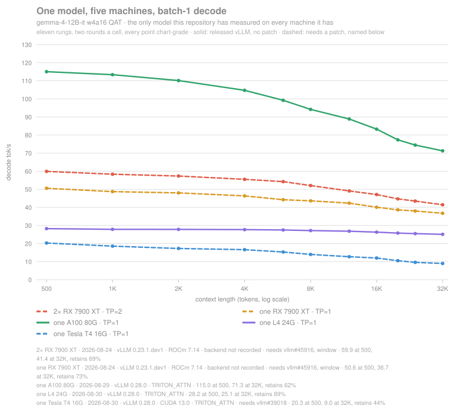
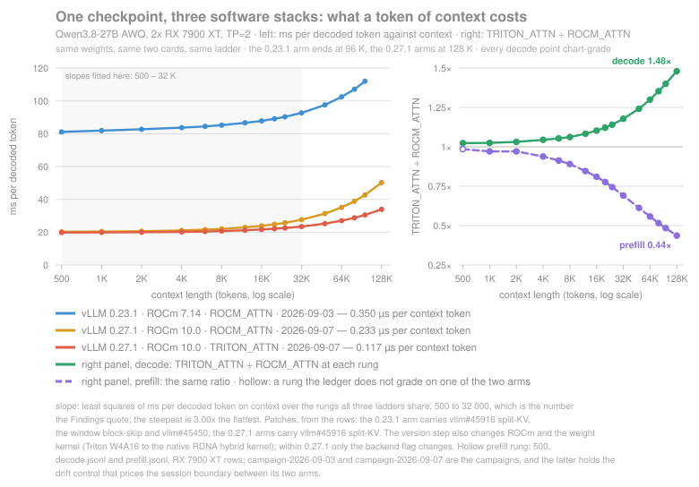

# dual-radeon-vllm

[English](README.md) | 中文

**[项目网站 · 交互图表与文章](https://cadamcat.github.io/dual-radeon-vllm/index.zh.html)**

**两张消费级 Radeon（RX 7900 XT、gfx1100）运行 tensor-parallel vLLM 的实测记录，包括缺少 PCIe AtomicOps 导致的 RCCL 故障、修复方法和逐请求原始数据。**

在原始基线上，`gemma-4-31B`（w4a16）以 **43 tok/s** 解码，两张卡**同时**各消耗 265 W；26B MoE 在短上下文达到 **108 tok/s**。这些数据来自 VFIO 虚拟机：跨 CPU die 的 PCIe 3.0、没有 GPU P2P，当时也没有 PCIe atomics。后续 campaign 使用的软件版本、平台状态和补丁各自记录，不能把这套基线配置套到所有测量上。

**从这里开始：** [诊断与修复 RCCL](#诊断与修复-rccl) · [主要发现](#主要发现) · [双卡实测](#双卡实测) · [限制与绕行方法](#限制与绕行方法) · [全部 campaign](benchmarks/CAMPAIGNS.md)

## 测量平台

| 机器 | 卡数 | 来源 | 上下文范围 | 起始日期 |
|---|---|---|---|---|
| **RX 7900 XT**（gfx1100） | 2，也测 1 | 自有 | 500–32 000，后续到 **128 000** | 2026-07-25 |
| A100 SXM4 80G | 1 | Colab | 500–32 000 | 2026-08-29 |
| L4 24G · T4 16G | 1 | Colab | 500–32 000，L4 到 128 000 | 2026-08-30 |
| A100 SXM4 40G | 1 | Colab | 带宽利用率推导的专项检查 | 2026-09-02 |
| H100 80G | 1、2、4 | Modal | 500–128 000 | 2026-09-03 |
| H200 143G · B300 275G | 1 | Modal | 500–128 000 | 2026-09-03 |
| RTX PRO 6000 96G | 1、2 | Modal | 500–128 000 | 2026-09-03 |

十三种机器配置、八个 checkpoint、60 个结果文件里 5 796 条请求级测量、两份跨机器投影里 2 330 个 chart-grade 格子、八组双卡/四卡上 880 个 all-reduce 格、13 篇中英对照的长文——这些计数由 [`verify_doc_figures.py`](benchmarks/analyze/verify_doc_figures.py) 从文件重算。

## 三部分内容，各自可以独立使用

- **RCCL 修复。** 57 行的复现程序定位 hostcall 分派拒绝；裸机使用去掉 hostcall 的 RCCL 重建，虚拟机通常先检查一行直通配置。
- **数据与工具。** 逐请求原始记录、生成这些记录的 runner，以及无需 GPU 的分析脚本。后续 campaign 在每格旁记录时钟、功耗、温度、显存和内存控制器忙碌比例。`prefill.jsonl`、`decode.jsonl` 从原始记录生成，并与之核对。
- **Ubuntu 内核中的权重加载回归。** 可写文件映射的 host→device 拷贝在 `7.0.0-28-generic` 上降到 **2 MiB/s**；补齐缺失提交可修复，Ubuntu 的正常稳定版更新 `7.0.0-30.30~24.04.1` 也包含修复。同一机器、同一复现程序从 **16 019.3 ms → 15.3 ms**（[数据](benchmarks/hmm-kernel-three-states.json)）。该修复并非由本报告促成。内核升级后，可写映射本身的代价仍在：clone flag 在 checkpoint 放得进 RAM 时值 **1.5–2.0×**，放不进时值 **7.5×**（[数据](benchmarks/loader-flag-kernel-30.json)）。早期发布的 3.9–5.6× 没有控制 page cache，未能复现。完整证据、被推翻的解释及 [ROCm#6523](https://github.com/ROCm/legacy-rocm-build/issues/6523)、[LP#2161985](https://bugs.launchpad.net/ubuntu/+source/linux-hwe-7.0/+bug/2161985)、[vllm#49991](https://github.com/vllm-project/vllm/pull/49991) 的关系见 [§8](docs/open-questions.md)。

## 适用对象与支持状态

双卡一启动就报错，先看[诊断](#诊断与修复-rccl)；已经跑通、想知道性能，看[实测](#双卡实测)；准备购买或搭建，先看[限制](#限制与绕行方法)。

这不是 vLLM fork。RCCL 修复发生在 VM 配置或通信库层；`patches/` 里的下游 vLLM 改动用于复现其他性能实验，RCCL 修复不依赖它们。

这是可复现的工程记录，不是提供通用 ROCm/vLLM 支持的产品。欢迎探针输出、测量和更正。二进制绑定 GPU 架构和 ROCm 版本；RCCL 修复端到端只在 gfx1100 验证，其他编译目标的边界见下表。另一个已测试的 runtime opt-in 允许空 hostcall buffer，但真正执行 hostcall 的内核仍可能发生设备故障。

[开放问题](docs/open-questions.md) 包括：虽然已经定位到去掉 `NDEBUG` 的源码变更，前后版本重建并计数的实验仍未完成。

## 主要发现

- **内存控制器忙碌比例排对了测到的第二张卡收益。** `mem_busy` 在五种设定里都排对了顺序，从第二张 Radeon 到第二张 H100。它支持的是这些实验里的排序关系，不能直接当作任意硬件的吞吐预测器（[跨机器记录](benchmarks/cuda-modal/README.md)）。
- **集合通信带宽跨 62 倍，batch-1 解码所在的延迟端只跨 3.2 倍。** 七组双卡／四卡的带宽差，并没有转化为对应的推理差距（[all-reduce 实测](benchmarks/allreduce-2026-09-03/)）。
- **四张租来的卡自动选了三种注意力后端。** 没有人显式传入 backend 参数；每个跨机器比值都包含软件路径的差别，后端身份来自各自的 serve 日志（[配置记录](benchmarks/cuda-modal/README.md#four-cards-three-attention-backends-nobody-asked-for-any-of-them)）。
- **在测过的 H100 栈上，有界窗口比混合 SSM 更平。** 到 128 000，Muse-Glimmer 吞吐下降 4.8 %，混合 SSM 的 27B 下降 21.8 %，稠密 31B 下降 22.0 %。这些是所测路径的结果；下文的软件栈对照说明，不能直接归因于架构（[长上下文记录](benchmarks/cuda-modal/README.md#context-past-32-000-and-what-makes-a-curve-flat)）。
- **这对卡自己也到了 128 000。** 六个模型里四个跑完十六档；12B 到末端下降 52.5 %，有界窗口的 Muse-Glimmer 下降 17.3 %。遥测随每格保存，可以区分计算、内存和时钟状态（[本机长上下文 campaign](benchmarks/campaign-2026-09-03/README.md)）。
- **gfx11 的 GQA 门排除了一条更快的内核路径。** 在测过的 `gqa_ratio` 1–2 范围，自定义内核比回退路径快 **1.84–7.28×**；这是 gfx1100 上的内核计时，不是端到端加速比（[计时与正确性记录](benchmarks/vllm-50603/)）。[vllm#54210](https://github.com/vllm-project/vllm/pull/54210) 的应用检查在这对卡上跑完 **1 319 题** gsm8k：放宽门后，strict 正确题数改变 **−2 题**，flexible 改变 **+2 题**，两 rank 的实际分派都有记录。它只覆盖 gemma-3、ratio 2，未测延迟（[完整结果](benchmarks/vllm-54210-gsm8k/)）。
- **同一 checkpoint 的深度成本随软件栈相差 3.00×。** 在共同的 **500–32 000** 档位，Qwen3.8-27B 每增加一个上下文 token 的解码成本为 **0.350 → 0.233 → 0.117 µs**：依次是 vLLM 0.23.1、0.27.1，以及 0.27.1 加 `--attention-backend TRITON_ATTN`。跨版本还改变 ROCm 和权重内核；0.27 内部的 A/B 只改 backend，Triton 路径带 #45450。到 **128 000**，Triton 相对 ROCM_ATTN 的 **decode 为 1.48×，prefill 为 0.44×**。版本复测和后端 A/B 分别在 [09-06](benchmarks/campaign-2026-09-06/) 与 [09-07](benchmarks/campaign-2026-09-07/)。
- **分页解码内核改十一行，滑窗模型在 32 K 获益 2.75× 和 3.15×。** 原循环读完整段序列，再掩掉窗口外的内容；跳过这些块避免了无效读取（[实现与正确性论证](docs/sliding-window-block-skip.md)）。
- **投机解码在 32 K 慢 3.4×，原因是路径选择。** 每步两个 query token 让 Triton 从分段的 3D 解码落到串行 2D 路径；#45450 重新允许 3D 后，这对卡在 32 K 从 **8.81 → 32.57 tok/s**，并已跨两家厂商验证（[分析](docs/speculative-decoding-on-rdna.md)）。
- **贪心解码的不确定性来自 W4A16 的 split-K 收尾。** 同一 vLLM 提交、相同后端，加入 #54706 固定顺序归约后，32 次贪心生成 32 次一致；同构建不打补丁时，4 个格子里有 2 个会变（[内核 A/B](benchmarks/gfx1100-w4a16-54706/README.md)）。
- **第二张 Radeon 在 BF16 上值 1.70×，w4a16 上值 1.18×。** 这是八月软件栈上的结果；量化模型也会从第二张卡获得容量，不能只用单流解码吞吐判断它的用途（[双卡实测](#双卡实测)）。

## RCCL 故障

### 谁会遇到

触发条件是 **GPU 到 root complex 的 PCIe 路径缺少 AtomicOps**。消费级芯片组后的插槽，以及某些 QEMU/VFIO 直通配置都可能出现；虚拟化 Instinct 也不能只凭卡型排除。裸机上，[@adderek 的双 7900 XTX／B550 记录](https://github.com/ROCm/legacy-rocm-build/issues/6520) 复现了故障和修复：CPU 直连的卡正常，经过芯片组的卡受影响，关闭 IOMMU 也不改变结果。

| 构建目标 | 典型显卡 | 验证状态 |
|---|---|---|
| **gfx1100** | RX 7900 XTX / XT | ✅ 在本机 RX 7900 XT 上端到端验证 |
| gfx1030 | RX 6800 / 6800 XT / 6900 XT | 🟡 混合 gfx1030+gfx1100 机器上，原版在 gfx1030 rank 拒绝分派，重建版到达 Init COMPLETE；尚无完成的 collective。两种架构混用时仍在 `libamdhip64` 出错，缺少第二张 gfx1030 无法隔离原因 |
| gfx1101 | RX 7800 XT / 7700 XT | ⚪ 仅静态验证 |
| gfx1102 | RX 7600 / 7600 XT | ⚪ 仅静态验证 |
| gfx1200 | RX 9060 | ⚪ 仅静态验证 |
| gfx1201 | RX 9070 / 9070 XT | ⚪ 仅静态验证 |
| gfx908 | MI100 | ⚪ 仅静态验证 |

⚪ 指设备镜像的 `hidden_hostcall_buffer` 为零，尚未在对应硬件运行；🟡 指有原版对照的分派验证，不代表 collective 或模型已跑通。

编译库不放进 git。[Releases](../../releases) 提供 gfx1100 和多架构构建及 SHA256；也可运行 [`build/build-rccl-nohostcall.sh`](build/build-rccl-nohostcall.sh)，再用 [`build/verify-nohostcall.sh`](build/verify-nohostcall.sh) 独立检查。慢主机上单目标构建约 85 分钟。

### 报错原文

<details>
<summary><b>从搜索引擎来的，可以先对照这些日志</b></summary>

```text
RuntimeError: NCCL error: unhandled cuda error
HIP failure 'the operation cannot be performed in the present state' at .../rccl/src/enqueue.cc:2061
hipModuleLaunchKernel: Returned hipErrorIllegalState
NCCL WARN cuMem support requires VMM RDMA support
rocvirtual.cpp:4208  Pcie atomics not enabled, hostcall not supported
rocvirtual.cpp:4636  AQL dispatch failed!
amdgpu 0000:0b:00.0: amdgpu: PCIE atomic ops is not supported
```

适用于两张或更多 AMD GPU 上调用 RCCL 的程序，包括 vLLM、PyTorch DDP/FSDP。这里的探针用于区分 hostcall 拒绝与其他 RCCL 故障。

`cuMem support requires VMM RDMA support` 是例外：它表示 RCCL 放弃自己的 cuMem 路径，并不是本故障的原因。它与真正错误出现在同一份日志里。`NCCL_CUMEM_ENABLE=1` 在本机没有作用；[`diagnose/sweep.sh`](diagnose/sweep.sh) 记录了试过的环境变量组合。

</details>

### 已验证的原始配置

| 项目 | 七月 Radeon 基线 |
|---|---|
| GPU | 2× RX 7900 XT（gfx1100、RDNA3），每卡 20 GB |
| 互连 | 跨 die、PCIe 3.0、无 P2P，`NCCL_P2P_DISABLE=1` |
| 主机 | Threadripper 1950X、X399 |
| 虚拟化 | Proxmox VE + QEMU，VFIO 直通；七月基线没有 PCIe atomics |
| 软件栈 | ROCm 7.14 · vLLM 0.23 · PyTorch 2.11 · 重建的 RCCL 2.27.7 |

后续 Qwen3.8 campaign 使用 ROCm 10.0、vLLM 0.27，各自记录后端和补丁。这里没有匹配的裸机 P2P 性能对照，不能把 VFIO 吞吐当作它的下界。

### 诊断与修复 RCCL

**虚拟机先查直通配置。** 同时直通 GPU 的音频功能，会让 QEMU 不再公布 AtomicOp completer 支持。在本机，`hostpci0: 0000:0b:00` 改为 `hostpci0: 0000:0b:00.0`，仅保留 GPU 单一功能，就让原版 RCCL 从失败变为正常。先看 [VFIO A/B](docs/vfio-atomics.md)，再决定是否重建。

裸机或上述方法不适用时，运行：

```bash
./diagnose/check-platform.sh
hipcc --offload-arch=gfx1100 -O2 diagnose/hipgate3.cpp -o diagnose/hipgate3 && ./diagnose/hipgate3
```

第二条不依赖 RCCL、PyTorch 或 vLLM。**plain 内核通过，而 hostcall 内核被拒绝，或设备端标记始终没有打印，就命中了这个问题。**

```text
--- device 0 (gfx1100) ---
  plain     ok        launch:no error | sync:no error | lastError:no error
  hostcall  REFUSED   launch:the operation cannot be performed in the present state | ...
```

探针同时读取 launch、sync、`hipGetLastError()` 和设备端 `printf`：某些机器在拒绝分派后，前两项仍返回成功，只有错误状态和缺失的设备输出暴露问题。它逐卡运行，因为同机两张卡的 PCIe 路径可能不同。

ROCm **7.2.1** 起的 RCCL 设备内核带 hostcall 声明。缺少 AtomicOp 到 `hipErrorIllegalState` 的因果链、逐步验证命令和排除的假设，见 [root-cause.md](docs/root-cause.md)。[部署步骤](docs/deploy-vllm.md) 和[进一步诊断](docs/diagnosis.md) 分别说明怎么修、如何确认不是其他故障。

**重建使用测过的 RCCL 2.27.7 配方。** 下表的环境是没有 PCIe atomics、只应用 `NDEBUG` 重建：

| RCCL 源码 | hostcall 声明 | 结果 |
|---|---:|---|
| **2.27.7**，`ROCm/rccl` 的 `release/rocm-rel-7.1.1.1` | **0** | ✅ 已跑通 |
| 2.30.4，`ROCm/rocm-systems` 的 `projects/rccl` | **3** | ❌ 仍失败 |

2.30.4 重建的设备镜像即使不含 `__ockl_*` 符号，设备链接器仍保留 hostcall buffer 声明；仅靠 `NDEBUG` 无法去掉这个要求。源码迁移及证据见 [开放问题](docs/open-questions.md)。

有 atomics 时，**原版 2.30.4 通过 12/12 个 collective 用例**（[能力矩阵](benchmarks/rccl-ndebug-ab-2026-09-04/)）。没有 atomics 时，**打过补丁的 HIP runtime 加 `HIP_HOSTCALL_ALLOW_MISSING=1` 也通过 12/12 个 collective**，并完成 TP=2 Qwen3-8B serve 请求（[runtime 实验](benchmarks/clr-hostcall-load-check-2026-09-05/)）。这个 flag 需要对应 runtime 补丁；实际执行 hostcall 会在设备上出错。

从 PCIe 路径到失败内核的完整调查，见文章 [RCCL、atomics 与 hostcall](https://cadamcat.github.io/dual-radeon-vllm/articles/rccl-atomics-hostcall.zh.html)。

## 双卡实测

**2026-07-25 基线**：原生 vLLM，五个模型、十一档上下文，292 次测量、零错误。**2026-08-24 复测**：带补丁容器，相同梯度，372 次测量、九种配置，其中六种重跑七月配置作对照。四种在 0.25 % 内复现，一种噪声太大无法判断，一种不复现。完整方法见 [benchmarks.md](docs/benchmarks.md)。

每次请求使用随机前缀避开 prefix cache；decode 计时从首 token 到末 token，排除 TTFT。以下日期是实验身份的一部分。测量方法与计时检查见文章 [如何测解码](https://cadamcat.github.io/dual-radeon-vllm/articles/measuring-decode.zh.html)。


这张静态图从 [`ledger.jsonl`](benchmarks/ledger.jsonl) 为每个模型选择一条线，携带日期、vLLM、ROCm 和补丁信息；实线是记录中的发行版路径，虚线需要标出的补丁。**候选集停留在八月，未纳入九月 campaign。** 新栈和更深上下文的结果已在[后端 A/B](benchmarks/campaign-2026-09-07/)与[交互长上下文图](https://cadamcat.github.io/dual-radeon-vllm/index.zh.html#figlong)中。

下表回答同一场、同一软件栈的模型比较；上图跨栈选线。Qwen3.8 在表里约 10.7 tok/s，在旧图深端约 36.1 tok/s，后者使用 0.27 和 #45916，不能把差额解释成同场模型比较。

### vLLM TP=2 解码表：2026-08-24，带补丁容器

| 模型 | 精度与架构 | 500 tok | 8 K | 32 K | 说明 |
|---|---|---:|---:|---:|---|
| **gemma-4-26B-A4B** | int4，128-expert MoE | **107.7** | 92.6 | **72.9** | 本场九种配置中最快；首次 engine 启动约 26 分钟，未测热启动成本 |
| Qwen3-8B | BF16，dense | 79.5 | 73.4 | 61.4 | TP=1 → TP=2 为 **1.70×** |
| gemma-4-12B-it | w4a16 QAT，dense | 59.9 | 52.0 | 41.4 | TP=1 → TP=2 为 **1.18×** |
| **Muse-Glimmer-30B** | int4，2048 滑窗 | 43.7 | 37.8 | **37.4** | 窗口之后较平；本场深度斜率 0.122 µs |
| **gemma-4-31B-it** | w4a16 QAT，dense | 42.8 | 36.6 | 29.3 | 双卡同步负载 |
| **Qwen3.8-27B** | 非对称 AWQ int4，hybrid SSM | 12.3 | 11.7 | **10.7** | 本场最慢；后续 0.27 路径不是这个结果 |

gemma-3-27b 的三个值为 **44.8 / 34.6 / 22.1 tok/s**。它已测但未画入这张图，因为短上下文与 Muse-Glimmer、31B 的线过于接近。七月原版的表和图仍在 [benchmarks.md](docs/benchmarks.md)。

四个七月模型作为对照重跑，除 31B 的 **−0.85 %** 尚未解释外，其余在 0.25 % 内。Qwen3.8 的 32 K 吞吐是七月 Qwen3.6 的 **2.51×**，斜率浅 **12.4×**，但这里同时换了 checkpoint 和补丁，不能作为补丁 A/B。

Qwen3.8 的非对称 int4 checkpoint 在 **0.23 镜像**上错过 gfx1100 原生 W4A16 路径，所有量化线性层走 Triton；匹配条件下改用对称 checkpoint，在 1 K 快 **3.24×**（[对称性 A/B](benchmarks/w4a16-symmetry/)）。gemma-3 的 checkpoint 是对称的；本场两个 27B 的短上下文吞吐相差 **3.64×**。后续同一非对称 checkpoint 的跨版本与后端实验，说明斜率结论也受软件栈限制。

### llama.cpp 对照

有完整记录的对照是 Qwen3.6-27B Q4_K_M：双卡 layer split，llama-bench 构建 `47c786924`，每轮生成 128 token。它比较该 checkpoint 的 ROCm 与 Vulkan 后端，不比较后续 Qwen3.8 vLLM 路径。下表为各上下文深度的 decode tok/s。

| 上下文 | ROCm | Vulkan |
|---:|---:|---:|
| 512 | 24.89 | 28.61 |
| 4096 | 24.56 | 28.27 |
| 8192 | 24.17 | 27.79 |
| 16384 | 21.35 | 27.04 |
| 24576 | 22.48 | 26.43 |
| 32768 | 21.84 | 26.04 |

原始记录：[ROCm](benchmarks/llamacpp-depth-sweep-rocm.json)、[Vulkan](benchmarks/llamacpp-depth-sweep-vulkan.json)。另有 [gemma-4 layer/tensor 对照](benchmarks/llamacpp-layer-vs-tensor.json)，记录了跨进程波动和 layer split 的状态恢复故障。

### 图表与读法

**一个模型，五种机器配置。** 八月的 gemma-4-12B-it 对照，每条线十一档、每格两轮，均为 chart-grade。租用卡的后续梯度另见[双卡之外](#双卡之外)。



| 机器 | @500 | @32 K | 保留率 |
|---|---:|---:|---:|
| A100 80G | 115.0 | 71.3 | 61.9 % |
| **2× RX 7900 XT** | **59.9** | **41.4** | **69.2 %** |
| RX 7900 XT | 50.6 | 36.7 | 72.6 % |
| L4 24G | 28.2 | 25.1 | 88.8 % |
| Tesla T4 16G | 20.3 | 9.0 | 44.3 % |

A100 相对双卡的领先从 **1.92×** 缩到 **1.72×**；第二张 Radeon 的收益从 **1.18×** 缩到 **1.13×**。12B 在单卡上已放得下，第二张卡的单流解码收益有限；prefill 和容量要分别看。

**吞吐排序在两个端点相同，保留率排序却不同。** L4 最平，T4 两项都最低；T4 相对 L4 从浅端 **0.72×** 降到深端 **0.36×**。T4 的虚线表示需要 #39018 改 prefill tile 才能加载模型：原内核要求的 shared memory 超出 Turing 上限。该补丁只改 prefill，decode 值不受它影响；T4 prefill 不能作同路径比较，另一次 VM 测量对拟合的影响也在[其记录](benchmarks/cuda-t4/campaign-2026-08-30/README.md)中。

**第二张 GPU 的收益取决于模型。** 虚线单卡、实线双卡；BF16 的蓝色两线拉开，4-bit 的绿色两线靠近。互连和 RCCL 相同。这张图保留八月复测，七月版本在 [benchmarks.md](docs/benchmarks.md)。


**一个上下文 token 要付多少解码时间。** 纵轴是每个输出 token 的耗时，斜率是增加上下文的边际成本。下面使用与前面静态吞吐图相同的截至八月底的候选集；它不包括九月的新路径。


**同一 checkpoint 在三个软件栈上。** 上面每条线都是一个模型在截至八月测得最好的栈上；这张图固定模型、换栈：Qwen3.8-27B，同样的权重、同样的两张卡，分别在已发布的 0.23.1 臂、0.27.1 自选后端，以及 0.27.1 加 `--attention-backend TRITON_ATTN` 上。在三条梯度共有的 500–32 000 档上拟合，最陡的斜率是最平的 **3.00×**；数字与[主要发现](#主要发现)一致。右图说明最平的线不等于全面更好：Triton 相对 0.27 自选的后端，decode 占优、prefill 吃亏，两个比值都随深度单调远离 1.0。0.27 内部只换后端参数；跨版本还同时换了 ROCm 和权重内核，所以第一步是栈的差别，不只是后端的差别。原始行：[campaign-2026-09-03](benchmarks/campaign-2026-09-03/) 是 0.23.1 臂，[campaign-2026-09-07](benchmarks/campaign-2026-09-07/) 是两条 0.27 臂和给会话边界定价的漂移对照。



**混合 SSM 在测过的 stock 路径上崩塌，注意力修复让斜率变浅。** Qwen3.8 的线性注意力层之外仍有 full-attention 层。在该 0.27 stock 路径上，32 K 每 token 为 **261.9 ms**；应用 #45916 后为 **27.7 ms**，深端快 **9.5×**，斜率从 **7.41 降到 0.26 ms/千 token**。


两臂在同一栈各跑两遍，并反转顺序；路由从 TP worker 内部记录。8 K 出现两个模态，图画的是高模态均值，图注注明了这一点，ledger 仍将该格标为非 chart-grade。[方法与原始行](docs/hybrid-decode-on-rdna.md)。

后续版本与后端对照见文章 [吞吐保留率与深度成本](https://cadamcat.github.io/dual-radeon-vllm/articles/depth-cost-is-the-stacks.zh.html)；[跨机器保留率复算](docs/depth-cost-cross-machine.md)进一步检验换重复轮次或成本定义后，排名变化是否仍然成立。

**滑窗跳块。** 窗口以内没有可跳过的块，加速比为 **1.00×**；出窗口后收益递增，到 32 K，gemma-3 为 **2.75×**、Muse-Glimmer 为 **3.15×**。实现及已替换掉的旧正确性论证见[正文](docs/sliding-window-block-skip.md)。


**Prefill 的形状可复现，峰值位置不够稳定。** 八月 8B 在 500 档比 MoE 快 **2.1×**，到 32 K 则被 MoE 超过。四个模型的采样峰值在 2 K，MoE 在 4 K、hybrid 在 6 K；同一 MoE 七月却在 6 K。拟合截距 `a` 不复现，`S* = √(a/c)` 的峰值推断已撤回；`b`、`c` 所描述的线性／二次形状更稳定。[拟合与撤回记录](docs/benchmarks.md#4-prefill-peaks-and-where-the-peak-sits)。


**投机解码的路径问题也出现在 CUDA。** 在 A100 的 gemma-4 默认 Triton 路径上，MTP 在 30 K 为 **−28.2 %**、50 K 为 **−61.1 %**；后一个点关闭 MTP 快 **2.57×**。换成 FlashInfer 会改变结论，不能把 MTP 本身当作统一的开关建议。[A100 后端矩阵](benchmarks/cuda-a100/README.md)。


每步不止一个 query token 时，Triton 会把 decode 送到串行 2D 路径，绕开分段的 3D flash-decoding。#45450 让它重新进入 3D；Radeon 的 32 K 从 **8.81 → 32.57 tok/s**。A100 输出逐位一致，Radeon 内核误差受一 ULP 界约束。[跨厂商验证](benchmarks/cuda-a100/45450-validation/README.md)与[机制分析](docs/speculative-decoding-on-rdna.md)。


注意力路径如何改变投机解码的成本，见文章 [投机解码](https://cadamcat.github.io/dual-radeon-vllm/articles/speculative-decoding-net-loss.zh.html)。

### 两张 Radeon 对一张 A100

这里比较 gemma-4-31B，stock、无投机解码、十一档、每格两轮，两边每格都为 chart-grade：

| 上下文 | 2× RX 7900 XT | A100 80G | A100 领先 |
|---|---:|---:|---:|
| 500 | 43.16 | 58.51 | **1.36×** |
| 2 K | 41.04 | 57.15 | 1.39× |
| 8 K | 36.86 | 51.63 | 1.40× |
| 16 K | 33.63 | 47.50 | 1.41× |
| 32 K | 29.54 | 42.41 | **1.44×** |

差距约 **1.4×**，从浅端到深端缓慢扩大。早期由四个单次 probe 推出的 U 形差距没有在完整 campaign 中出现，围绕那个 U 形写出的机制解释也随之撤回。

这不是完全匹配的软件栈：Radeon 为 vLLM 0.23，A100 为 0.28.0。ROCm 0.27 镜像的 Quark 插件无法加载 gemma-4 的异构 `head_dim` 配置，因此缺少同版本对照。其他已测组合还会带入不同补丁。

由每 GPU 的 bytes/token 推得的 31B 带宽利用率约 **63 %**，计算值 **62.8 %**，应读作上界。A100 上真正测到的单步权重读取比例是 12B 的 **81.6 %** 和 31B 的 **85.6 %**；“每步把全部 checkpoint 读一遍”的推导在那里高估 **17–23 %**。不能把另一台机器的修正系数直接套回 Radeon（[内存控制器测量](benchmarks/cuda-a100/campaign-2026-09-02/README.md)）。

投机解码会倒转比较：MTP `k=3` 在 32 K 对 Radeon 为 **+7.9 %**，对 A100 为 **−20.1 %**，两机开投机后接近。补丁不匹配，所以它回答各机所测配置能做到什么，不能隔离硬件效果。A100 在 prefill 和批量吞吐的计算优势另看：对单张 Radeon，dense 12B 的 prefill 线性项差 **3.3×**、二次项差 **6.7×**（[benchmarks.md §4](docs/benchmarks.md#4-prefill-peaks-and-where-the-peak-sits)）。

文章 [一张 A100 对两张 Radeon](https://cadamcat.github.io/dual-radeon-vllm/articles/a100-vs-two-radeons.zh.html)逐步展开这组比较，以及两边软件路径不同带来的限制。

### 获取原始数字

```bash
cd benchmarks/analyze
python3 summarize.py
python3 decode_slope.py
python3 analyze.py
python3 verify_doc_figures.py
```

这些分析无需 GPU，只依赖 Python 标准库。七月 [`results.jsonl`](benchmarks/results.jsonl) 含 **309 条记录**：146 prefill、146 decode，另有 17 条 engine 元数据、状态和注释。八月是 [`results-2026-08-24.jsonl`](benchmarks/results-2026-08-24.jsonl)，独立 campaign 各自保存记录；跨机器数据通过 `prefill.jsonl`、`decode.jsonl` 汇总。验证器检查的是发布值、证据和投影；结论的适用范围仍需回到实验判断。

### 如何解释结果

- **参数量不能代替架构和路径。** 八月 MoE 比 8B 快 **1.355×**，比更大的 31B 快 **2.513×**。非对称 checkpoint 绕过原生内核的影响要单独控制。
- **Eager 与 CUDA graph 是不同配置。** 早期 `--enforce-eager` 记录为慢 **3.8–7.2×**，并出现不对称功耗、上下文不敏感等现象，但原始输出没有保存；compiled campaign 有已入库的逐请求行。早期“MoE 很慢”的结论来自 eager 记录。
- **第二张卡也买容量。** 七月 12B 的 KV pool 从 **151 808 → 354 707 tokens**，标称并发从 **4.60× → 10.75×**；不要只看单流解码的 1.19×。
- **Attention 比线性层更容易并行。** 两轮 campaign 和另一种拟合方法中，TP=2 的二次项改善 **1.83–2.08×**，线性项改善 **1.23–1.31×**。拟合截距和峰值没有同样的稳定性。
- **Hybrid 结论必须带栈。** 七月 Qwen3.6 每增加一个上下文 token 成本 **4.84 µs**，是 dense 8B 的 **41×**。Qwen3.8 的匹配 A/B 和后续深度成本实验不能被这条旧建议覆盖。
- **llama.cpp 的上下文对照是 Qwen3.6。** 同一对卡、ROCm 后端，512 token 时 **24.89 tok/s**，32 K 时 **21.84 tok/s**，分别比七月 stock vLLM 快 **2.1×**、**5.1×**。它没有比较新版 vLLM 上的 Qwen3.8。
- **利用率要分测量与推导。** 解码按模型权重推得的带宽利用率从 8B 单卡的 88 % 到 12B 双卡的 38 %；prefill 达到约 37 % 的名义 FP16 峰值。权重读取量的限制见前面的 A100 实测。

## 双卡之外

[租用卡 campaign](benchmarks/cuda-modal/README.md) 使用相同梯度、六个 checkpoint 和同一 harness；每台机器仍运行自己的软件路径。

| 发现 | 证据与边界 |
|---|---|
| 先有控制组 | Modal A100 与 L4 在控制臂上分别于 **0.07 %**、**0.9 %** 内复现 Colab 八月数据；其他跨卡比值仍包含内核／后端差别 |
| `mem_busy` 支持排序预测 | 五种设定中，越依赖内存的模型越受带宽变化影响；H200 测前提交的预测排对了顺序，猜错了幅度 |
| 新卡不总是更快 | B300 在 26B MoE 上输给 H100，在 8B 上赢 **66 %**，记录中的价格是 **1.8×** |
| NVLink 的差别在第四张卡更明显 | 增加第三、第四张卡的成本，有 NVLink 为 **×1.22**，无 NVLink 为 **×2.71**；双卡无 NVLink 比有 NVLink 高 **20 %** |

交互站的[长上下文图](https://cadamcat.github.io/dual-radeon-vllm/index.zh.html#figlong)把本机 09-03 梯度与租用卡并排画到 128 000。不同 checkpoint、backend 或投机设置分别保留身份，不能只按显示名拼接。文章 [跨机器的内存控制器忙碌比例](https://cadamcat.github.io/dual-radeon-vllm/articles/mem-busy-orders-five-settings.zh.html)解释这种排序能预测什么、又在哪些地方失效。

## 限制与绕行方法

以下均指记录中测过的软件镜像和路径，每个链接给出版本；不能直接推广到之后的所有版本。

| 项目 | 状态与下一步 |
|---|---|
| **FP8 权重／KV** | 🔴 所测 RDNA3 路径不可用 |
| **AITER 内核** | 🔴 所测 vLLM 用 `is MI3XX` 限制，gfx1100 回退到 Triton |
| **调优后的 fused-MoE 配置** | 🔴 所测发行版未为 AMD GPU 提供，使用通用默认配置 |
| **Hybrid SSM** | 🟡 七月 Qwen3.6 与八月 Qwen3.8 同时换 checkpoint 和补丁；[匹配的 0.27 A/B](benchmarks/hybrid-splitkv-027/)隔离 #45916，[后续 backend campaign](benchmarks/campaign-2026-09-07/)覆盖同一 Qwen3.8 的长梯度。按记录选择栈和后端 |
| **MTP 投机解码** | 🟡 未修补的 Triton 在长上下文落到串行路径；[#45450](benchmarks/cuda-a100/45450-validation/README.md) 恢复分段路径。最终收益仍取决于模型和深度，见[完整对照](docs/speculative-decoding-on-rdna.md) |
| **`ROCM_ATTN` 滑窗解码** | 🟡 原 paged-decode 循环扫描全序列，之后才 mask。跳块补丁不近似注意力：32 K 内核收益为 gemma-3 的 2.75×、Muse-Glimmer 的 3.15×，窗口内不变。端到端八月值分别约 22.05、37.4 tok/s。该实现与先前的 [#49588](https://github.com/vllm-project/vllm/pull/49588) 重合，提供的是另一份证据；[正文](docs/sliding-window-block-skip.md)也说明为何旧 token-id 正确性论证不成立 |
| **MoE `torch.compile`** | 🟡 `env_override.py` 每次 `import vllm` 都写死 `TORCHINDUCTOR_COMPILE_THREADS=1`，外部设环境变量会被覆盖。MoE 的 `init_engine_s` 为 **1569 s**，12B **TP=2 为 1538 s**；12B TP=1 两次启动为 **59.67 s、33.36 s**。engine init 只界定编译所在的时间段，不能当作纯编译计时。改对应源码；eager 会损失性能，见[文章](https://cadamcat.github.io/dual-radeon-vllm/articles/moe-written-off-by-eager.zh.html) |
| **多租户服务** | 🟡 未测；当前是单流或轻并发 |
| **GPU P2P** | 🔴 本拓扑没有，以上吞吐均在无 P2P 条件下测得 |
| **RCCL 2.30.4** | 🟡 有 atomics 时原版工作；`NDEBUG` 重建不能单独去掉要求。带补丁 runtime 的 opt-in 是另一条已测路径，实际 hostcall 仍可能设备故障 |

背景与源码证据见 [architecture-notes.md](docs/architecture-notes.md)。

## 硬件与加载

**Atomics 是一条路径的能力。** Root complex 必须支持 32／64-bit completer，中间交换端口必须能路由 AtomicOp。`amdgpu` 通过 `pci_enable_atomic_ops_to_root()` 检查它们。Root port 的 `Routing-` 指 root ports 之间的 peer-to-peer，不等于它缺少到系统内存的 atomics；芯片组下游端口的 `Routing-` 则会截断后面的插槽。

本机 X399 root ports 公布 `Routing- 32bit+ 64bit+`。显卡交给 VFIO 前，在 host 绑定 `amdgpu` 的启动记录里没有 atomics 缺失，而旧 guest 配置里两张卡都缺失。这与裸机 B550 一张 CPU 直连、一张走芯片组的案例一起说明：P2P、IOMMU 和 hostcall 所需 atomics 必须分开判断。

**QEMU 的 multifunction 是另一种触发方式。** 同时直通多个功能时，模拟 root port 公布 `32bit- 64bit-`；只传 GPU 单一功能会自动公布 completer 支持，QEMU 从 8.1.0 起如此。[VFIO 实验](docs/vfio-atomics.md)保存了前后对照。

本机在 **2026-08-23 14:17 UTC** 改为单功能直通。七月基线没有 atomics；八月复测、loader 和滑窗实验有。后续 hostcall campaign 为诊断又主动切换过，平台状态以每次记录为准。

**推理本身不需要 hostcall。** 它服务于设备 `printf`／`assert`；没有 atomics 时，出问题的是带 hostcall 声明的内核分派。去掉它的运行成本已用 [±NDEBUG A/B](benchmarks/rccl-ndebug-ab-2026-09-04/README.md) 测过：batch-1 decode 形状及端到端未见代价，16–512 KB 时，未修复构建的 all-reduce 延迟高 **2.7–4.6 %**，2 MB 起未见差别。

**优先相同型号的卡。** 混合卡受更小／更慢的一张限制，layer split 还可能让旧卡成为散热热点。相邻插槽双卡会互吸排风，本机持续负载上卡 junction 达 **99–100 °C**；对卡缝加 120 mm 风扇后降至 **90 °C**，两卡冷热顺序反转，上卡自身风扇也更慢。

**慢 CPU 主要拖累启动。** `torch.compile` 受 CPU 限制，并被所测 vLLM 固定为单线程；不能由启动慢推出稳态解码慢。

**权重加载需要同时看内核、映射方式和 RAM。** 可写 mmap 的 host→device 拷贝会对 resident pages 触发 copy-on-write。先升级有回归的内核；残余映射代价可比较 [#49991 clone flag](https://github.com/vllm-project/vllm/pull/49991)、`safe_open(..., backend="pread")` 和 `--safetensors-load-strategy eager`。pread 的内存占用最小，eager 峰值约为一个 shard 的两倍，所以大单 shard 可能反而放不下。[四个 checkpoint、四条加载路径的记录](benchmarks/loader-flag-kernel-30.json)和[机制说明](docs/open-questions.md)。

`mmap` 的上限看 `MemTotal`，不能只看当时的空闲内存。**21.67 GiB** 文件曾无法映射进该 guest 的 **21.43 GiB**；后来扩到 **23.40 GiB**，加 **8 GiB swap**，该 checkpoint 才能加载。容量需要为映射上限留空间。

内核、映射与 RAM 容量之间的关系，见文章 [权重加载与内核回归](https://cadamcat.github.io/dual-radeon-vllm/articles/weight-loading-19x.zh.html)。

## 仓库地图

```text
diagnose/       零依赖探针；hipgate3.cpp 对照 plain 与 hostcall
  check-platform.sh  dmesg、PCIe 桥链和 hostcall 计数
  ar.py             torchrun all_reduce 复现
  sweep.sh          试过但无效的环境变量组合
  logs/             故障发生时的 AMD_LOG_LEVEL=4 日志
build/          重建不带 hostcall 的 RCCL，独立检查声明和 nccl 符号
deploy/         将通信库、桩和环境配置注入 ROCm/vLLM 容器
benchmarks/
  results.jsonl             七月原始请求、元数据和状态
  results-2026-08-24.jsonl   八月复测
  <campaign>/               假设、方法、结果、原始行与日志
  CAMPAIGNS.md              从 campaign README 生成的完整索引
  analyze/                  投影、拟合、制图与发布数字核对
  harness/                  runner、遥测、schema 与 PCIe preflight
  prompts/                  构建并核对实际使用的 prompt 梯度
  repro-mmap-prot.py         可写映射的 host→device 拷贝复现
  repro-mmap-prot.hip.cpp    不依赖 PyTorch 的同一 HIP 复现
  cuda-*/                   各 CUDA 平台；cuda-modal 汇总租用卡
  ledger.jsonl              原 Radeon decode 投影，带栈与补丁身份
  prefill.jsonl             跨机器 prefill 数据及拟合
  decode.jsonl              跨机器 decode 数据，与 ledger 重合格核对
patches/        复现实验使用的下游改动，详情见其 README
  sliding-window-block-skip.patch  从窗口起点开始 paged-decode 扫描
  wintest.py                       前后计时与 token-id 记录
  adapt-muse-glimmer.py            向旧版 vLLM 适配模型文件
docs/
  root-cause.md              RCCL 故障的证据链
  vfio-atomics.md            虚拟机里的一行修复：单功能直通的 A/B
  benchmarks.md             双卡基线、复测和拟合
  open-questions.md          未证明的问题与被推翻的解释
  architecture-notes.md      MoE、dense、hybrid SSM 的路径差异
  hybrid-decode-on-rdna.md   hybrid 注意力剖析和匹配 A/B
  sliding-window-block-skip.md     滑窗补丁及正确性边界
  speculative-decoding-on-rdna.md  投机解码路径与跨厂商验证
  depth-cost-cross-machine.md     保留率排序的跨机器敏感性
  deploy-vllm.md / diagnosis.md    部署与诊断
  assets/                   独立 SVG
```

`wintest.py` 记录过的 token ids 不能单独证明补丁正确：本机未打补丁时，greedy 解码也曾不确定。原因和修复已由内核 A/B 单独验证。

RCCL 证据已提交到 [ROCm#6520](https://github.com/ROCm/legacy-rocm-build/issues/6520)，并在 [#6074](https://github.com/ROCm/legacy-rocm-build/issues/6074) 留有入口；直通注意事项提交给 `pve-devel`，记录中的 [v3](https://lore.proxmox.com/all/20260831130752.37364-1-Xy2462381442@gmail.com/) 是 review 后合并成的一份补丁。Hybrid、GQA 和 gsm8k 的上游记录由对应正文链接。

只打开一个文件的话：为数字而来读 [benchmarks.md](docs/benchmarks.md)，为故障而来读 [root-cause.md](docs/root-cause.md)。

## 更正记录

- **2026-09-08：来源核查。** 旧英文表的四项 Vulkan／MTP 数字未在本次核查的已入库 llama.cpp 记录里找到对应行；两种语言均改用有原始行的 Qwen3.6 ROCm／Vulkan 深度扫描。八月 12B 第二张卡收益的头条和表注改为 1.18×，1.19× 属于七月；eager 对照补明原始输出未保存。

- **2026-09-08：适用软件栈。** 旧首页在匹配 A/B 已修复相关路径后，仍笼统建议避开 hybrid SSM、关闭 MTP。现按路径选择。七月 Qwen3.6 与八月 Qwen3.8 不能隔离补丁效果；五机吞吐排序在两个端点没有改变。RCCL 警告也区分失败的重建、有 atomics 的原版和无 atomics 的 runtime opt-in。
- **2026-08-27：参数量比较。** “27B 被更大的 31B 打败”混入了 checkpoint 对称性和内核回退影响；用[对称性 A/B](benchmarks/w4a16-symmetry/)隔离。MoE 相对 dense 的结果保留。
- **2026-09-02：第二张卡收益。** [同场遥测](benchmarks/campaign-2026-09-02d/)显示，8B 单卡 `mem_busy` 为 **90 %**，12B 为 **56 %**；集合通信和功耗上限的控制也各有测量。它支持这组条件下的排序，不能证明任意机器的因果规律。
- **2026-08-30 起：prefill 固定成本。** 已撤回由不稳定截距 `a` 推出的短上下文交叉点和“每次 all-reduce 约 1.05 ms”解释。之后[真正测到](benchmarks/allreduce-2026-09-02/) batch-1 collective 为 **16.6–21.5 µs**，8B 每步 73 次合计 **1.22 ms**。交叉点仍未确定；[多轮复测](benchmarks/campaign-2026-09-02b/)否定了“首请求总是慢”的说法，短上下文噪声随时钟状态变化。
- **2026-09-05：复现程序长度。** “30 行”已更正为 57 行；旧数字不是源码曾经的准确长度。中文和英文使用同一份 `diagnose/hipgate3.cpp`。
- **2026-08-31：A100 比较。** 由单次、投机、不同上下文 probe 推出的 U 形差距被完整 stock campaign 推翻；这里保留的是约 1.4× 的差距和无法完全匹配软件栈的限制。
- **2026-08-29／09-02：带宽利用率。** 31B 比较曾误引 12B 的利用率，已改正；之后 A100 对实际权重读取量的测量又限定了这类推导的含义，当前按上界阅读。

## 致谢与许可证

调查始于一台双 RX 7900 XT 的家用 Proxmox 服务器。探针、构建脚本、部署文件和文档是本项目的工作，按 [MIT License](LICENSE) 发布。

仓库不包含 RCCL 源码。用这里脚本编译出的 RCCL 是其衍生作品，仍需履行 BSD-3-Clause 义务，见 [NOTICE.md](NOTICE.md)。RCCL 版权属于 AMD，部分属于 NVIDIA。本项目与 AMD 无隶属、背书或支持关系。
