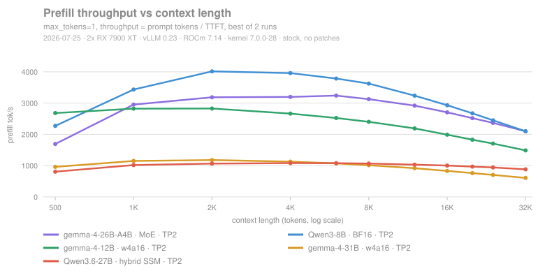

# Benchmarks: five architectures across eleven context lengths

Measured 2026-07-25 on the [verified configuration](../README.md#verified-configuration):
2× RX 7900 XT, vLLM 0.23 + ROCm 7.14, tensor parallel, inside a VFIO guest with no
P2P and no PCIe atomics. **292 measurements, zero errors.** Raw data and the runner
are in [`benchmarks/`](../benchmarks/); method is in
[`benchmarks/README.md`](../benchmarks/README.md).

Five models were chosen to isolate *architecture*, not size:

| Model | Precision | Architecture | Why it is here |
|---|---|---|---|
| Qwen3-8B | BF16 | dense | the only unquantised model — the quantisation control |
| gemma-4-12B-it | w4a16 QAT | dense | same family/vocab/quantisation as the 31B, only smaller |
| gemma-4-31B-it | w4a16 QAT | dense | the workhorse |
| Qwen3.6-27B | AWQ int4 | **hybrid SSM** (48 linear-attention + 16 full-attention layers) | does linear attention pay off? |
| gemma-4-26B-A4B | int4 | **MoE**, 128 experts | does sparse activation pay off? |

---

## Decode


| context | 26B MoE | 8B BF16 | 12B w4a16 | 31B w4a16 | 27B SSM |
|---:|---:|---:|---:|---:|---:|
| 500 | **107.8** | 79.6 | 59.9 | 43.2 | 12.1 |
| 2 000 | 104.3 | 77.1 | 56.5 | 41.0 | 11.0 |
| 8 000 | 92.6 | 73.3 | 52.0 | 36.9 | 8.5 |
| 16 000 | 83.5 | 68.8 | 46.5 | 33.6 | 6.3 |
| 32 000 | **72.8** | 61.4 | 41.9 | 29.5 | **4.2** |

All TP=2, CUDA graph enabled, `--gpu-memory-utilization 0.85`, 512-token outputs,
mean of all rounds (two per point; four for the two points that were re-measured —
see [`benchmarks/README.md`](../benchmarks/README.md#two-anomalies-and-what-was-done-about-them)).

By parameter count the order should be 8B > 12B > 26B > 27B > 31B. It is not.
**The fastest model is the 26B MoE, and the 27B hybrid-SSM is 3.6× slower than the
larger 31B dense.** On this stack, architecture matters more than size.

---

## 1. The MoE was written off because nobody waited for the compiler

An earlier probe on this machine recorded `gemma-4-26B-A4B` as *"torch.compile
did not finish in 20 minutes → impractical → forced `--enforce-eager` → ~15 tok/s"*,
plus *"severely asymmetric power draw (131 W / 65 W), the MoE fails to load both
cards evenly"*. It was filed under "architectures held back by ROCm".

With the startup timeout raised, the compile **finishes in 26 minutes** (`init engine
1569 s`). It was never impossible; it was never given the time.

| | eager (earlier) | compiled (this run) | |
|---|---|---|---|
| decode, short context | ~15 tok/s | **107.8 tok/s** | **7.2×** |
| decode at 32 K | not measured | 72.8 tok/s | |
| power | 131 W / 65 W, *asymmetric* | **265 W / 265 W, synchronised** | the asymmetry was an artefact |
| verdict | "MoE is unfriendly on ROCm" | **fastest architecture measured here** | overturned |

The same mistake had been made on the 12B: an earlier context sweep used
`--enforce-eager` to dodge the compile wall and produced "a flat 15.8 tok/s,
independent of context, with power bouncing between the cards". Compiled, it is
**59.9 tok/s** with steady synchronised power.

> **`--enforce-eager` costs 3.8–7.2× on this stack.** It also fabricates
> qualitative artefacts — asymmetric power, context-independence — that invite
> wrong architectural conclusions. Compilation output is **cached** (12B: 1538 s
> cold, 33 s warm), so it is a one-off per (model, parallelism) pair.
> **Do not draw architecture conclusions from eager numbers.**

---

## 2. The hybrid-SSM's long-context advantage is inverted

A linear-attention layer carries a fixed-size recurrent state, so decoding should
cost the **same** whatever the context length. That is the entire selling point.


| model | ms/token added per context token | relative to 8B | decode drop 500 → 32 K |
|---|---:|---:|---:|
| Qwen3-8B · BF16 | 0.118 µs | 1.0× | −22.8 % |
| gemma-4-26B-A4B · MoE | 0.142 µs | 1.2× | −32.5 % |
| gemma-4-12B · w4a16 | 0.228 µs | 1.9× | −30.1 % |
| gemma-4-31B · w4a16 | 0.339 µs | 2.9× | −31.5 % |
| **Qwen3.6-27B · hybrid SSM** | **4.840 µs** | **41×** | **−64.9 %** |

The 27B's decode time is a near-perfect straight line in context length —
82.5 ms/token at 518 tokens, 235.3 ms/token at 32 084, constant slope:

```
ctx    518:  82.51 ms/token
ctx   8026: 117.23 ms/token
ctx  16058: 156.99 ms/token
ctx  24040: 196.85 ms/token
ctx  32084: 235.29 ms/token
```

O(1) was promised; O(S) was measured. The implementation is not taking an
incremental recurrent path at decode. Corroboration: power *falls* at long context
(232 + 227 W at 24 K, against 265 + 265 W at short) — the GPUs are waiting, not
working. The logs show `Cannot use ROCm custom paged attention kernel, falling back
to Triton` and `TRITON_ATTN backend`.

At 32 K it delivers 4.2 tok/s, which is unusable.

**But prefill keeps the promise.** The 27B is the only model whose prefill gets
*faster* with length (805 → 880 tok/s, +9 %) while dense models lose 8–44 %.
Linear attention does deliver O(S) prefill here. If your workload is
ingest-heavy and generation-light, that is worth something. Otherwise, avoid it.

---

## 3. Whether the second GPU buys speed depends on memory-bandwidth utilisation


| model | TP=1 | TP=2 | speed-up | efficiency |
|---|---:|---:|---:|---:|
| Qwen3-8B · BF16 | 46.7 | 79.6 | **1.70×** | 85 % |
| gemma-4-12B · w4a16 | 50.3 | 59.9 | **1.19×** | 59 % |

Same machine, same interconnect, same RCCL — a threefold difference in what the
second card buys.

### A test that needs only one model's own data

Model decode as `T = W/(N·B) + C`: *W* bytes of weights per token, *N* GPUs, *B*
per-GPU bandwidth, *C* everything that does not parallelise. If TP=2's gain came
purely from halving bandwidth-bound traffic, the time saved must equal `W/(2B)`,
and the implied *B* must not exceed the hardware's 800 GB/s.

| model | T(TP1) | T(TP2) | saved | implied per-GPU bandwidth | |
|---|---:|---:|---:|---:|---|
| Qwen3-8B BF16 | 21.41 ms | 12.56 ms | 8.85 ms | 850 GB/s (106 % of peak) | plausible |
| gemma-4-12B w4a16 | 19.88 ms | 16.69 ms | 3.19 ms | **1611 GB/s (201 % of peak)** | **impossible** |

This comparison never leaves a single model, so architectural differences cannot
explain it. It proves the 12B **was not bandwidth-bound to begin with**: had it
been, TP=2 would have saved 6.4 ms and reached 74.5 tok/s. The lever "halve the
weight traffic" simply does not apply to it. The 8B, reading back essentially the
hardware peak, was genuinely bandwidth-bound.

### Size and quantisation both matter

Is the 12B's low utilisation caused by quantisation, or merely by having fewer
bytes to move per token? `gemma-4-31B` settles it: **same quantisation, same
262 144 vocabulary, same sliding window, same family** — only bigger (21.67 GiB
per token, more even than the 8B's 14.02 GiB BF16).

| configuration | per-GPU bytes/token | memory-bandwidth utilisation |
|---|---:|---:|
| 8B BF16, TP=2 | 7.01 GiB | **75 %** |
| 31B w4a16, TP=2 | 10.84 GiB | **63 %** |
| 12B w4a16, TP=2 | 4.78 GiB | **38 %** |

Both effects are real: at equal quantisation the larger model reaches 1.7× the
utilisation (63 % vs 38 %), *and* the 31B still trails the BF16 8B by 12 points
despite moving 55 % more data.

> **Rule of thumb.** BF16 models: the second card buys **speed** (1.70×).
> Quantised models: it mostly buys **capacity** — the 12B's KV pool goes from
> 151 808 to 354 707 tokens and concurrency from 4.60× to 10.75×, while single-stream
> decode gains only 19 %.

**Honest caveat.** The 8B and 12B also differ in layer count (36 vs 48), hidden size
(4096 vs 3840), heads (32/8 vs 16/8), vocabulary (151 936 vs 262 144) and sliding-window
attention (none vs 1024). Two claims survive strictly: *(a)* the 12B is not
bandwidth-bound (single-model test), and *(b)* at equal quantisation, bigger means
higher utilisation (controlled 31B-vs-12B comparison). "Quantisation itself costs
something" is supported but not isolated.

---

## 4. Prefill peaks, and where the peak sits



Prefill throughput rises, peaks, then falls. Split the time into a per-request
constant, a linear term and attention's quadratic term:

```
T(S) = a + b·S + c·S²      →      throughput S/T(S) peaks at   S* = √(a/c)
```

The peak depends only on fixed overhead and the quadratic term — the linear term
drops out. Least squares over all measured points. Residuals are under 2 % above ~1 K tokens; the 500-token point sits 5–18 % off the fit in every configuration, which is where the
three-term model is weakest:

| configuration | a (fixed) | b (linear) | c (quadratic) | S* = √(a/c) | measured peak |
|---|---:|---:|---:|---:|---:|
| Qwen3-8B TP2 | 95 ms | 195.9 µs/tok | 8.69 ns/tok² | 3310 | 2000 |
| Qwen3-8B TP1 | **19 ms** | 257.5 µs/tok | 15.90 ns/tok² | 1098 | ≤500 |
| gemma-4-12B TP2 | 15 ms | 330.1 µs/tok | 10.70 ns/tok² | 1203 | 2000 |
| gemma-4-26B-A4B TP2 | 123 ms | 250.1 µs/tok | 7.00 ns/tok² | 4196 | 6000 |
| gemma-4-31B TP2 | 152 ms | 744.4 µs/tok | 28.04 ns/tok² | 2331 | 2000 |
| Qwen3.6-27B TP2 | 211 ms | 842.0 µs/tok | 8.88 ns/tok² | 4877 | 6000 |

### What TP=2 costs, in numbers

The 8B's two fits decompose the cost of the second GPU:

| coefficient | TP=1 | TP=2 | ratio | reading |
|---|---:|---:|---:|---|
| a, fixed | 19 ms | 95 ms | **5× worse** | +76 ms — the collective-communication latency floor |
| b, linear | 257.5 | 195.9 µs/tok | 1.31× better | all-reduce bandwidth cost is folded in here |
| c, attention | 15.90 | 8.69 ns/tok² | **1.83× better** | **91 % parallel efficiency**; attention needs no communication |

36 layers × 2 all-reduces = 72 collectives; 76 ms ÷ 72 ≈ **1.05 ms each** — the
price of one all-reduce over host shared memory on a cross-die PCIe 3.0 link with
no P2P. The attention term's 1.83× (91 %) independently reproduces the 1.80× / 90 %
measured earlier by a different method.

> **Practical consequence.** Larger fixed cost plus smaller quadratic term means the
> curves cross: at 512 tokens **one card prefills faster than two** (3460 vs 2270
> tok/s); by 979 tokens the pair is ahead (3434). Below roughly 1 K tokens of prompt,
> TP=2 hurts time-to-first-token.

**A prediction that failed.** Expecting bigger models to have larger fixed overhead,
we predicted the 31B would peak later than the 8B. It peaks *earlier* (S* = 2331 vs
3310): `a` did grow (95 → 152 ms), but `c` grew 3.2×, and S* is the square root of
their ratio. Correct statement: **as models grow, attention's quadratic cost grows
faster than fixed overhead, so the prefill peak moves left.**

**Open question.** gemma-4 uses a 1024-token sliding window, which should suppress
the quadratic term; measured `c` is nevertheless the largest of the set. We suspect
the `TRITON_ATTN` fallback does not exploit the sliding window. Not verified — see
[open-questions.md](open-questions.md).

---

## 5. Capacity, which single-stream numbers hide

| configuration | KV pool | concurrency | usable context |
|---|---:|---:|---|
| 8B BF16, **TP=1** | 8 442 tok | **1.01×** | **8.4 K** — ladder truncated at 6 K |
| 8B BF16, TP=2 | 122 322 tok | 3.71× | 33 K |
| 12B w4a16, TP=1 | 151 808 tok | 4.60× | 33 K |
| 12B w4a16, TP=2 | **354 707 tok** | **10.75×** | 33 K |
| 31B w4a16, TP=2 | 57 259 tok | 1.74× | 33 K |
| 26B MoE, TP=2 | 313 631 tok | 9.50× | 33 K |

15.26 GiB of BF16 weights on a single 20 GiB card leaves room for 8 442 KV tokens —
concurrency 1.01×, i.e. barely one request. This is the plainest argument for the
second card, and it is invisible in a tokens-per-second table.

---

## Choosing a model on this hardware

| you want | use | because |
|---|---|---|
| **speed with a large model** | **gemma-4-26B-A4B (MoE, compiled)** | 107.8 tok/s, still 72.8 at 32 K, concurrency 9.5×; costs one 26-minute compile, then cached |
| best single-model quality | gemma-4-31B w4a16 | 43.2 tok/s, 29.5 at 32 K; concurrency only 1.74× |
| short prompts, low latency | one card — or llama.cpp | below ~1 K tokens TP=1 has better TTFT; llama.cpp on one card still does 64.9 tok/s on the 12B, above vLLM's dual-card 59.9 |
| many concurrent users | 12B w4a16, TP=2 | 354 707 KV tokens, concurrency 10.75× |
| **long context** | **avoid hybrid-SSM** | the 27B drops to 4.2 tok/s at 32 K; dense and MoE lose only 23–33 % |

## Three findings worth carrying elsewhere

1. **Architecture beats parameter count.** 26B MoE (107.8) > 8B dense (79.6) >
   12B (59.9) > 31B (43.2) > 27B hybrid-SSM (12.1).
2. **Never conclude anything from `--enforce-eager` numbers.** Two wrong conclusions
   on this machine came from exactly that, at a cost of 3.8–7.2× and fabricated
   power asymmetry.
3. **Separate the two things a second GPU buys.** BF16: 1.70× speed. Quantised:
   1.19× speed but 2.3× concurrency. Decide which one you need before buying.

---

*Campaign executed 2026-07-25, 03:09–06:44. All services restored afterwards; VRAM
returned to baseline. The 19–48× slow weight loading that used to make a campaign
like this impractical has a working workaround. Part of it is explained now: AMD
named the kernel line, and copy-on-write is broken on every resident page because
the permission comes from the VMA rather than from what the copy actually does.
The other part, a ~700× collapse on one host kernel, is still open. Both are in
[open-questions.md §8](open-questions.md).*
